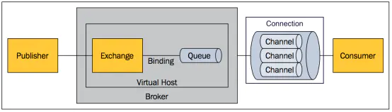
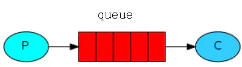
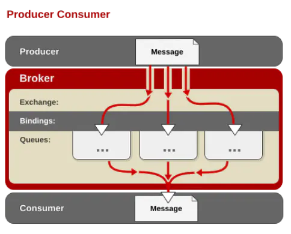
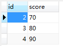
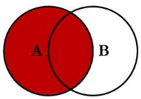
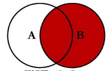

javap -c -s -v -l synchronizedTest.class

# 12、ThreadLocal

**Synchronized用于线程间的数据共享，而ThreadLocal则用于线程间的数据隔离。**

https://www.jianshu.com/p/3c5d7f09dfbd

　　在同步机制中，通过对象的锁机制保证同一时间只有一个线程访问变量。这时该变量是多个线程共享的，使用同步机制要求程序慎密地分析什么时候对变量进行读写，什么时候需要锁定某个对象，什么时候释放对象锁等繁杂的问题，程序设计和编写难度相对较大。

　　而ThreadLocal则从另一个角度来解决多线程的并发访问。ThreadLocal会为每一个线程提供一个独立的变量副本，从而隔离了多个线程对数据的访问冲突。因为每一个线程都拥有自己的变量副本，从而也就没有必要对该变量进行同步了。ThreadLocal提供了线程安全的共享对象，在编写多线程代码时，可以把不安全的变量封装进ThreadLocal。

[一个 ThreadLocal 和面试官大战 30 个回合 (qq.com)](https://mp.weixin.qq.com/s/_uAO5xdWypEBecqKUvV6gA)

举个栗子，我们支付宝每秒钟同时会有很多用户请求，那每个请求都带有用户信息，我们知道通常都是一个线程处理一个用户请求，我们可以把用户信息丢到 Threadlocal 里面，让每个线程处理自己的用户信息，线程之间互不干扰。

Threadlocal 主要用来做**线程变量的隔离**，这么说可能不是很直观。

还是说前面提到的例子，我们程序在处理用户请求的时候，通常后端服务器是有一个线程池，来一个请求就交给一个线程来处理，那为了防止多线程并发处理请求的时候发生串数据，比如 AB 线程分别处理甲和乙的请求，A 线程本来处理甲的请求，结果访问到乙的数据上了，把乙支付宝的钱转走了。所以就可以把甲的数据跟 A 线程绑定，线程处理完之后解除绑定。

**说说`Threadlocal` 怎么实现线程变量的隔离的？**


- ThreadLocalMap 类的定义在 Threadlocal 中。

- - 第一，Thread 对象是 Java 语言中线程运行的载体，每个线程都有对应的Thread 对象，存放线程相关的一些信息；
  - 第二，Thread 类中有个成员变量 ThreadlocalMap，你就把它当成普通的Map，key 存放的是 Threadlocal 对象，value 是你要跟线程绑定的值（线程隔离的变量），比如这里是用户信息对象（UserInfo）

 **Thread 类有个 ThreadlocalMap 属性的成员变量，但是ThreadlocalMap 的定义却在 Threadlocal 中，为什么这么做？**

-  ThreadLocalMap 就是为维护线程本地变量而设计的，只做这一件事情。

-  这个也是为什么 ThreadLocalMap 是 Thread 的成员变量，但是却是 Threadlocal 的内部类（非 public，只有包访问权限，Thread 和 Threadlocal 都在 java.lang 包下），就是让使用者知道 ThreadLocalMap 就只做保存线程局部变量这一件事的。


**为什么不用线程对象（Thread 对象）作为key，这样不是更清晰，直接用线程作为 key 获取线程变量**

- 我理解的话，因为是在ThreadLocal里维护key为Thread的map的话，因为Thread是有生命周期，如果这个thread死了，则ThreadLocal的map中对应的该thread的对象一直占用着空间，却永远不会被用到了。其实更有甚者，由于hashmap里的key指向了thread，所以这个thread都不会被回收，这是对资源的最大浪费，随着越来越多的线程产生，越来越多的内存泄漏发生，这是很恐怖的。
- 但是致命的一点在于，本来ThreadLocal的作用就是来处理并发问题的，如果像我们写的ThreadLocal那样还是让所有的线程的都访问同一个map，因为map是线程不安全的，所以依然会有严重的并发问题。试想，一个线程插入数据时让map扩容，扩容的同时另一个线程来插入数据，这样就会引发并发问题。

我已经把用户信息存在线程变量里了，这个时候需要新增加一个线程变量，比方说新增用户地理位置信息，我们ThreadlocalMap 的 key 用的是线程，再存一个地理位置信息，key 都是同一个线程（key 一样），不就把原来的用户信息覆盖了嘛。Map.put(key,value) 操作熟悉吧，所以网上有些文章说 ThreadlocalMap 使用线程作为 key 是瞎扯的。

**那新增地理位置信息应该怎么做？**

新创建一个 Threadlocal 对象就好了，因为 ThreadLocalMap 的 key 是Threadlocal 对象，比如新增地理位置，我就 Threadlocal < Geo> geo = new Threadlocal（），存放地理位置信息，这样线程的 ThreadlocalMap 里面会有两个元素，一个是用户信息，一个是地理位置。

ThreadlocalMap 是什么数据结构实现的？

跟 HashMap 一样，也是数组实现的

```java
class ThreadLocalMap {
 *//初始容量*
 private static final int INITIAL_CAPACITY = 16;
 *//存放元素的数组*
 private Entry[] table;
 *//元素个数*
 private int size = 0;
}
```

table 就是存储线程局部变量的数组，数组元素是 Entry 类，Entry 由 key 和 value 组成，key 是 Threadlocal 对象，value 是存放的对应线程变量。

**ThreadlocalMap 发生 hash 冲突怎么办？跟 HashMap 有什么区别？**

有区别的，对待哈希冲突，HashMap 采用的链表 + 红黑树的形式，如下图，链表长度过长(>8) 就会转成红黑树：

ThreadlocalMap 既没有链表，也没有红黑树，**采用的是开放定址法** ，是这样，如果发生冲突，ThreadlocalMap 直接往后找**相邻**的下一个节点，如果相邻节点为空，直接存进去，如果不为空，继续往后找，直到找到空的，把元素放进去，或者元素个数超过数组长度阈值，进行扩容。

## 1、说一下用的消息中间件的原理（说了rabbitMQ的几种模型）

解耦、异步、削峰

https://www.zhihu.com/question/54152397?sort=created

https://www.jianshu.com/p/79ca08116d57

消息队列（Message Queue）是一种应用间的通信方式，消息发送后可以立即返回，由消息系统来确保消息的可靠传递。消息发布者只管把消息发布到 MQ 中而不用管谁来取，消息使用者只管从 MQ 中取消息而不管是谁发布的。这样发布者和使用者都不用知道对方的存在。



**模型**

- 消息模型

所有 MQ 产品从模型抽象上来说都是一样的过程：
 消费者（consumer）订阅某个队列。生产者（producer）创建消息，然后发布到队列（queue）中，最后将消息发送到监听的消费者。



- AMQP 中的消息路由

AMQP 中消息的路由过程和 Java 开发者熟悉的 JMS 存在一些差别，AMQP 中增加了 Exchange 和 Binding 的角色。生产者把消息发布到 Exchange 上，消息最终到达队列并被消费者接收，而 Binding 决定交换器的消息应该发送到那个队列。



- Exchange 类型

Exchange分发消息时根据类型的不同分发策略有区别，目前共四种类型：direct、fanout、topic、headers 。headers 匹配 AMQP 消息的 header 而不是路由键，此外 headers 交换器和 direct 交换器完全一致，但性能差很多，目前几乎用不到了

## 2、说说final,finally,finalize

1）、final修饰符（关键字）。被final修饰的类，就意味着不能再派生出新的子类，不能作为父类而被子类继承。因此一个类不能既被abstract声明，又被final声明。将变量或方法声明为final，可以保证他们在使用的过程中不被修改。被声明为final的变量必须在声明时给出变量的初始值，而在以后的引用中只能读取。被final声明的方法也同样只能使用，即不能方法重写。
2）、finally是在异常处理时提供finally块来执行任何清除操作。不管有没有异常被抛出、捕获，finally块都会被执行。try块中的内容是在无异常时执行到结束。catch块中的内容，是在try块内容发生catch所声明的异常时，跳转到catch块中执行。finally块则是无论异常是否发生，都会执行finally块的内容，所以在代码逻辑中有需要无论发生什么都必须执行的代码，就可以放在finally块中。

3）、finalize是方法名。java技术允许使用finalize（）方法**在垃圾收集器将对象从内存中清除出去之前做必要的清理工作**。这个方法是由垃圾收集器在确定这个对象没有被引用时对这个对象调用的。它是在object类中定义的，因此所有的类都继承了它。子类覆盖finalize（）方法以整理系统资源或者被执行其他清理工作。finalize（）方法是在垃圾收集器删除对象之前对这个对象调用的。


12、OOM了解吗？什么情况下会出现OOM？

13、二叉搜索树说一下？可以用来干什么？查找的最坏时间复杂度？什么情况下出现最坏？

14、java什么底层使用的[红黑树](https://www.nowcoder.com/jump/super-jump/word?word=红黑树)？[红黑树](https://www.nowcoder.com/jump/super-jump/word?word=红黑树)有什么优势？[红黑树](https://www.nowcoder.com/jump/super-jump/word?word=红黑树)的特性？

15、B树和B+树

## 3、进程间通信的有哪些？优缺点是什么

管道、信号量、信号、消息队列、共享内存、套接字

（1）管道分为有名管道和无名管道，其中无名管道是一种半双工的通信方式，数据只能单向流动，而且只能在具有亲缘关系的进程间使用，一般用于两个不同进程之间的通信。有名管道也是一种半双工的通信方式，但它允许无亲缘关系进程间的通信。
（2）信号量是一个计数器，可以用来控制多个线程对共享资源的访问，它不是用于交换大批数据，而用于多线程之间的同步。他常作为一种锁机制。因此，主要作为进程间以及同一个进程内不同线程之间的同步手段。
（3）信号是一种比较复杂的通信方式，用于通知接收进程某个时间已经发生。
（4）消息队列是消息的链表，存放在内核中并由消息队列标识符标识，消息队列克服了信号传递信息少，管道只能承载无格式字节流以及缓冲区大小受限等特点。
（5）共享内存就是映射一段能被其他进程所访问的内存，这段共享内存由一个进程创建，但多个进程都可以访问。他往往与其他通信机制，如信号量配合使用，来实现进程间的同步和通信。
（6）套接字可用于不同及其间的进程通信。

【解析】从单机和分布式角度给面试管阐述。

如果考虑单机模型，有**管道、内存共享、消息队列**。这三个模型中，内存共享程序最难写，但是性能最高。管道程序最好写，有标准接口。消息队列程序也比较好写，比如用发布/订阅模式实现具体的程序。如果考虑**分布式**模型，就有**远程调用、消息队列和网络请求**。直接发送网络请求程序不好写，不如直接用实现好的 RPC 调用框架（Remote Procedure Call，RPC）。RPC 框架会增加系统的耦合，可以考虑 消息队列，以及发布订阅事件的模式，这样可以减少系统间的耦合。

## 4、动态代理是什么思想，解决什么问题

**静态代理**

- 创建一个接口，然后创建被代理的类实现该接口并且实现该接口中的抽象方法。之后再创建一个代理类，同时使其也实现这个接口。在代理类中持有一个被代理对象的引用，而后在代理类方法中调用该对象的方法。
- 使用静态代理很容易就完成了对一个类的代理操作。但是静态代理的缺点也暴露了出来：由于代理只能为一个类服务，如果需要代理的类很多，那么就需要编写大量的代理类，比较繁琐。

动态代理

利用反射机制在运行时创建代理类

动态代理具体步骤：

- 通过实现 InvocationHandler 接口创建自己的调用处理器；
- 通过为 Proxy 类指定 ClassLoader 对象和一组 interface 来创建动态代理类；
- 通过反射机制获得动态代理类的构造函数，其唯一参数类型是调用处理器接口类型；
- 通过构造函数创建动态代理类实例，构造时调用处理器对象作为参数被传入。

原理：给某个对象提供一个代理对象，并且由代理对象控制原对象的访问，即不直接操控原对象，而是通过代理对象间接地操控原对象。

动态生成的好处很明显，代理逻辑与业务逻辑是互相独立的，没有耦合

## 5、Java语言的三大特性，说一下多态的应用实例

**封装、继承、多态**

**封装：**将事物封装成一个类，**减少耦合，隐藏细节**。保留特定的接口与外界联系，当接口内部发生改变时，不会影响外部调用方。

**继承：**从一个已知的类中**派生出一个新的类**，新类可以拥有已知类的行为和属性，并且可以**通过覆盖/重写来增强**已知类的能力。

多态：

多态的本质就是

**一个程序中存在多个同名的不同方法**

主要通过三种方式来实现：

- 通过子类对父类的**覆盖**来实现
- 通过在一个类中对方法的**重载**来实现
- 通过将**子类对象作为父类对象**使用来实现

## 6、[红黑树](https://www.nowcoder.com/jump/super-jump/word?word=红黑树)的理解

- 红黑树的特性：
- 每个节点是红色或者黑色；
- 根节点是黑色；
- 每个叶子节点是黑色；
- 如果一个节点是红色，则它的子节点必须是黑色；
- 从一个节点到该节点的子孙节点的所有路径上都包含相同数量的黑色节点；

​    首先红黑树是不符合AVL树的平衡条件的，即每个节点的左子树和右子树的高度最多差1的二叉查找树。但是提出了为节点增加颜色，**红黑是用非严格的平衡来换取增删节点时候旋转次数的降低**，任何不平衡都会在三次旋转之内解决，而AVL是严格平衡树，因此在增加或者删除节点的时候，根据不同情况，旋转的次数比红黑树要多。所以红黑树的插入效率更高 ！！！

​    红黑树的 查询性能略微逊色于AVL树，因为他比avl树会稍微不平衡最多一层，也就是说红黑树的查询性能只比相同内容的avl树最多多一次比较，但是，红黑树在插入和删除上完爆avl树， avl树每次插入删除会进行大量的平衡度计算，而**红黑树为了维持红黑性质所做的红黑变换和旋转的开销，相较于avl树为了维持平衡的开销要小得多**

## 7、N个节点的[红黑树](https://www.nowcoder.com/jump/super-jump/word?word=红黑树)最大高度是？

- "一棵含有n个节点的红黑树的高度至多为2log(n+1)"

## 8、java变量传递方式

​          **JAVA只有按值调用, 参数是什么都会复制一份再操作, 就算是对象的引用也会复制一份新的引用,只不过指向的是同一个对象**

**这种传参方式叫做按值传递, 传递的东西可以是引用**

## 9、深拷贝和浅拷贝

- 浅拷贝

是按位拷贝对象，它会创建一个新对象，这个对象有着原始对象属性值的一份精确拷贝。**如果属性是基本类型，拷贝的就是基本类型的值；如果属性是内存地址（引用类型），拷贝的就是内存地址 ，因此如果其中一个对象改变了这个地址，就会影响到另一个对象**。即默认拷贝构造函数只是对对象进行浅拷贝复制(逐个成员依次拷贝)，即只复制对象空间而不复制资源。

- 深拷贝

​    在拷贝引用类型成员变量时，为引用类型的数据成员另辟了一个独立的内存空间，实现真正内容上的拷贝。

- 深拷贝特点

(1) 对于基本数据类型的成员对象，因为基础数据类型是值传递的，所以是直接将属性值赋值给新的对象。基础类型的拷贝，其中一个对象修改该值，不会影响另外一个（和浅拷贝一样）。
 (2) 对于引用类型，比如数组或者类对象，**深拷贝会新建一个对象空间，然后拷贝里面的内容，所以它们指向了不同的内存空间**。改变其中一个，不会对另外一个也产生影响。

## 9、jdk1.8新特性知识点：

- Lambda表达式
- 函数式接口
- 方法引用和构造器调用
- Stream API
- 接口中的默认方法和静态方法
- 新时间日期API

## 10、Integer

Integer的范围是“-128～127”，当i在这个范围内是从IntegerCache中直接获取，当超越这个范围才会new 一个新的Integer对象

```java
Integer a = 300;
int b = 300;
//自动拆箱
System.out.println(a == b);//true

Integer c = 300;
//表明不是同一个对象
System.out.println(a == c);//false

Integer d = 3;
Integer e = 3;
//直接从IntegerCache中获取
System.out.println(d == e);//true
```

## 11、String str="i"与 String str=new String(“i”)一样吗？

不一样，因为内存的分配方式不一样。String str=“i"的方式，Java 虚拟机会将其分配到常量池中，如果常量池中有"i”，就返回"i"的地址，如果没有就创建"i"，然后返回"i"的地址；而 String str=new String(“i”) 则会被分到堆内存中新开辟一块空间。

String a = new String("123")，创建几个对象  一个

String b = a 有几个对象  一个

a = "456" 此时b变了吗，创建对象了吗    b没变，若常量池里面有456，则未创建对象，若无，创建

##  12、static 关键字 修饰的方法是否有线程安全问题

静态方法如果没有使用静态变量，则没有线程安全问题。

如果在静态方法里使用了静态变量，这就会有线程安全问题！

因为静态方法内声明的变量，每个线程调用时，都会新创建一份，而不会共用一个存储单元。比如这里的tmp,每个线程都会创建自己的一份，因此不会有线程安全问题。
注意:静态变量，由于是在类加载时占用一个存储区，每个线程都是共用这个存储区的，所以如果在静态方法里使用了静态变量，这就会有线程安全问题！

## 13、Mvc的优缺点

优点:

- 各施其职，互不干涉

  在MVC模式中，三个层各施其职，所以如果一旦哪一层的需求发生了变化，就只需要更改相应的层中的代码而不会影响到其它层中的代码。

- 有利于开发中的分工

  在MVC模式中，由于按层把系统分开，那么就能更好的实现开发中的分工。网页设计人员可以进行开发视图层中的JSP，对业务熟悉的开发人员可开发业务层，而其它开发人员可开发控制层。

- 有利于组件的重用

  分层后更有利于组件的重用。如控制层可独立成一个能用的组件，视图层也可做成通用的操作界面。

- MVC设计模式可以说实现了分层开发。各个层都有各个层的作用。

- 降低了层与层之间的依赖，有利于代码的标准化开发

- 再用新的代码业务逻辑替换时，只需要替换相对应的层，大大降低了我们的工作量，分工明确。

缺点:

- 增加了系统结构和实现的复杂性。对于简单的界面，严格遵循MVC，使模型、视图与控制器分离，会增加结构的复杂性，并可能产生过多的更新操作，降低运行效率。
- 视图与控制器间的过于紧密的连接。视图与控制器是相互分离，但确实联系紧密的部件，视图没有控制器的存在，其应用是很有限的，反之亦然，这样就妨碍了他们的独立重用。
- 视图对模型数据的低效率访问。依据模型操作接口的不同，视图可能需要多次调用才能获得足够的显示数据。对未变化数据的不必要的频繁访问，也将损害操作性能。
- 目前，一般高级的界面工具或构造器不支持MVC模式。改造这些工具以适应MVC需要和建立分离的部件的代价是很高的，从而造成使用MVC的困难。

## 14、RPC

RPC是指过程调用，也就是说两台服务器A、B，一个应用部署在A服务器上，想要调用B服务器上应用提供的函数/方法，由于不在一个内存空间，不能直接调用，需要通过网络来表达调用的语义和传达调用的数据。

主要是为了解决的两个问题：

- 解决分布式系统中，服务之间的调用问题。
- 远程调用时，要能够像本地调用一样方便，让调用者感知不到远程调用的逻辑。

## 15、用过的Linux命令

shutdown -h now        立刻关机

shutdown -r now        立刻重启

 ifconfig  --help：查看网卡信息

cd /    切换到根目录

ls       查看当前目录下的所有目录和文件

mkdir   创建目录

rm   删除目录或文件

mv 和 cp     目录修改

mv 当前目录  新目录

cp -r 目录名称 目录拷贝的目标位置   -r代表递归

find 目录 参数 文件名称

tar -zcvf  -打包压缩后的文件名 -要打包的文件

tar [-zxvf] 压缩文件 ：解压

## 16、接口和抽象类

**default**修饰方法只能在接口中使用，在接口中被default标记的方法为普通方法，可以直接写方法体

接口和抽象类都是继承树的上层，他们的共同点如下：
1)	都是上层的抽象层。
2)	都不能被实例化
3)	都能包含抽象的方法，这些抽象的方法用于描述类具备的功能，但是不比提供具体的实现。
他们的区别如下：
1)	在抽象类中可以写非抽象的方法，从而避免在子类中重复书写他们，这样可以提高代码的复用性，这是抽象类的优势；接口中只能有抽象的方法。
2)	一个类只能继承一个直接父类，这个父类可以是具体的类也可是抽象类；但是一个类可以实现多个接口。

## 17、Ping

Ping用于确定本地主机是不是可以与另外一台主机成功交换数据包，然后再根据返回的信息，我们就可以大致判断TCP/IP参数是否设置正确，网络是否畅通了。

ping使用的是ICMP协议，英文全称是：Internet Control Message Protocol（internet报文控制协议），
它是TCP/IP协议族的一个子协议，用于在IP主机、路由器之间传递控制消息。控制消息是指网络通不通、主机是否可达、路由是否可用等网络本身的消息。这些控制消息虽然并不传输用户数据，但是对于用户数据的传递起着重要的作用。
所以，ICMP协议是一种面向无连接的协议，用于传输出错报告控制信息。它是一个非常重要的协议，它对于网络安全具有极其重要的意义。

## 18、Web网站常见的几种攻击方式

- XSS跨站脚本攻击


跨站脚本攻击（XSS，Cross-site scripting）是最常见和基本的攻击WEB网站的方法。攻击者在网页上发布包含攻击性代码的数据。当浏览者看到此网页时，特定的脚本就会以浏览者用户的身份和权限来执行。通过XSS可以比较容易地修改用户数据、窃取用户信息，以及造成其它类型的攻击，例如CSRF攻击

常见解决办法:确保输出到HTML页面的数据以HTML的方式被转义

- CSRF跨站请求伪造攻击

跨站请求伪造（CSRF，Cross-site request forgery）是另一种常见的攻击。攻击者通过各种方法伪造一个请求，模仿用户提交表单的行为，从而达到修改用户的数据，或者执行特定任务的目的。为了假冒用户的身份，CSRF攻击常常和XSS攻击配合起来做，但也可以通过其它手段，例如诱使用户点击一个包含攻击的链接
解决的思路有:
      1.采用POST请求,增加攻击的难度.用户点击一个链接就可以发起GET类型的请求。而POST请求相对比较难，攻击者往往需要借助javascript才能实现
      2.对请求进行认证，确保该请求确实是用户本人填写表单并提交的，而不是第三者伪造的.具体可以在会话中增加token,确保看到信息和提交信息的是同一个人

- Http Heads攻击


   凡是用浏览器查看任何WEB网站，无论你的WEB网站采用何种技术和框架，都用到了HTTP协议.HTTP协议在Response header和content之间，有一个空行，即两组CRLF（0x0D 0A）字符。这个空行标志着headers的结束和content的开始。“聪明”的攻击者可以利用这一点。只要攻击者有办法将任意字符“注入”到 headers中，这种攻击就可以发生

## 19、消息队列

消息队列（Message Queue）是一种应用间的通信方式，消息发送后可以立即返回，由消息系统来确保消息的可靠传递。消息发布者只管把消息发布到 MQ 中而不用管谁来取，消息使用者只管从 MQ 中取消息而不管是谁发布的。这样发布者和使用者都不用知道对方的存在。

> 消息从某一端发出后，首先进入一个容器进行临时存储，当达到某种条件后，再由这个容器发送给另一端，称为延迟消息通讯 （异步通信）

而容器的一个具体实现就是MQ(Message Queue)；

何为AMQP?

一个提供统一消息服务的应用层标准高级消息队列协议,是一个通用的应用层协议

消息发送与接受的双方遵守这个协议可以实现异步通讯。这个协议约定了消息的格式和工作方式。

**Tip**：这三个场景也是消息队列的经典场景，大家基本上要烂熟于心那种，就是一说到消息队列你脑子就要想到**异步、削峰、解耦**，条件反射那种。

## 20、布隆过滤器

本质上布隆过滤器是一种数据结构，比较巧妙的概率型数据结构（probabilistic data structure），特点是高效地插入和查询，可以用来告诉你 **“某样东西一定不存在或者可能存在”**。

多个哈希函数确定

https://zhuanlan.zhihu.com/p/43263751

## 21、CGLIB

CGLIB代理主要通过对字节码的操作，为对象引入间接级别，以控制对象的访问。我们知道Java中有一个动态代理也是做这个事情的，那我们为什么不直接使用Java动态代理，而要使用CGLIB呢？答案是CGLIB相比于JDK动态代理更加强大，JDK动态代理虽然简单易用，但是其有一个致命缺陷是，只能对接口进行代理。如果要代理的类为一个普通类、没有接口，那么Java动态代理就没法使用了。关于Java动态代理，可以参者这里[Java动态代理分析](http://blog.csdn.net/danchu/article/details/70146985)

## 22、跳表

https://zhuanlan.zhihu.com/p/68516038

跳表全称为跳跃列表，它允许快速查询，插入和删除一个有序连续元素的数据链表。跳跃列表的平均查找和插入时间复杂度都是O(logn)，跳跃表的空间复杂度为 O(n)。。快速查询是通过维护一个多层次的链表，且每一层链表中的元素是前一层链表元素的子集（见右边的示意图）。一开始时，算法在最稀疏的层次进行搜索，直至需要查找的元素在该层两个相邻的元素中间。这时，算法将跳转到下一个层次，重复刚才的搜索，直到找到需要查找的元素为止。


一张跳跃列表的示意图。每个带有箭头的框表示一个指针, 而每行是一个稀疏子序列的链表；底部的编号框（黄色）表示有序的数据序列。查找从顶部最稀疏的子序列向下进行, 直至需要查找的元素在该层两个相邻的元素中间。

**跳跃表 vs 二叉查找树**

二叉查找树的插入、删除、查找也是近似 O(logn) 的时间复杂度，为什么要用跳表？

二叉查找树是有可能出现一种极端的情况的，就是如果插入的数据刚好一直有序，那么所有节点会偏向某一边。这种接结构会导致二叉查找树的查找效率变为 O(n),这会使二叉查找树大打折扣。例如


**跳跃表 vs 红黑树**

红黑树插入，删除结点时，是通过调整结构来保持红黑树的平衡，比起跳跃表直接通过一个随机数来决定跨越几层，在时间复杂度的花销上是要高于跳跃表的。

当然，红黑树并不是一定比跳跃表差，在有些场合红黑树会是更好的选择，所以选择一种数据结构，关键还得看场合。

**维护一组有序的集合，并且希望在查找、插入、删除等操作上尽可能快，那么跳跃表会是不错的选择。redis 中的数据数据便是采用了跳跃表，当然，ridis也结合了哈希表等数据结构，采用的是一种复合数据结构。**


##  23、内部类，内部类的使用场景（什么时候你使用内部类），mybatis可以使用内部类吗

内部类：https://www.jianshu.com/p/acff58ffcf94

Mybatis使用内部类
在MyBatis的mapper文件中使用内部类的方式为：类$内部类，如：

```xml
<resultMap id="OutBoundDetail" type="dto.outbound.OutBoundDetailDto$InnerClass" />
```

- 两个要点：
  内部类必须有无参构造函数
  内部类必须为静态类

## 24、LRU机制了解嘛？你如何实现，具体说说？

（页面淘汰机制，hashmap+双向[链表](https://www.nowcoder.com/jump/super-jump/word?word=链表)实现，但他说实际开发有权重参数进行[排序](https://www.nowcoder.com/jump/super-jump/word?word=排序)，我的做法也是对的）

缓存淘汰策略，计算机的缓存容量有限，LRU就是认为最近使用过的数据是有用的，很久没有使用的数据是无用的，内存满了就先删除哪些很久没有用的数据

```java
public class LRU2 {
    int cap;
    LinkedHashMap<Integer,Integer> cache = new LinkedHashMap<>();

    public LRU2(int cap) {
        this.cap = cap;
    }

    public int get(int key){
        if (!cache.containsKey(key)){
            return -1;
        }
        //将key变为最近使用
        makeRecently(key);
        return cache.get(key);
    }
    public void put(int key ,int val){
        if (cache.containsKey(key)){
            cache.put(key,val);
            makeRecently(key);
            return;
        }
        if (cache.size()>=this.cap){
            //
            int oldestKey = cache.keySet().iterator().next();
            cache.remove(oldestKey);
        }
        cache.put(key,val);
    }
    private void makeRecently(int key){
        int val = cache.get(key);
        //删除后重新放入
        cache.remove(key);
        cache.put(key,val);
    }
}
```

## 25、[红黑树](https://www.nowcoder.com/jump/super-jump/word?word=红黑树)结构(说4个特点)，如何自旋(忘了)

https://blog.csdn.net/s1143671457/article/details/103589509

## 26、怎么避免hash冲突

- 开放定址法

这种方法也称再散列法，其基本思想是：当关键字key的哈希地址p=H（key）出现冲突时，以p为基础，产生另一个哈希地址p1，如果p1仍然冲突，再以p为基础，产生另一个哈希地址p2，…，直到找出一个不冲突的哈希地址pi ，将相应元素存入其中。这种方法有一个通用的再散列函数形式：

- 再哈希法

这种方法是同时构造多个不同的哈希函数：Hi=RH1（key） i=1，2，…，k

当哈希地址Hi=RH1（key）发生冲突时，再计算Hi=RH2（key）……，直到冲突不再产生。这种方法不易产生聚集，但增加了计算时间。

- 拉链法

这种方法的基本思想是将所有哈希地址为i的元素构成一个称为同义词链的单链表，并将单链表的头指针存在哈希表的第i个单元中，因而查找、插入和删除主要在同义词链中进行。链地址法适用于经常进行插入和删除的情况。


https://www.nowcoder.com/discuss/624512?type=2&order=0&pos=69&page=1&source_id=discuss_tag_nctrack&channel=-1

## 27、讲讲 CopyOnWrite

https://blog.csdn.net/u014203449/article/details/83867921

CopyOnWrite容器

通俗地讲，当我们往容器中添加一个元素的时候，不是直接添加，而是对当前容器copy，复制一个容器，在这个复制的容器中添加元素，添加完之后，再将引用指向这个新容器。

优点：CopyOnWrite容器可以并发的进行读操作，而不需要加锁，因为 当前容器不会添加任何元素，所以这也是一种读写分离的思想，读和写的操作分开了。

添加元素的时候需要加锁，读的时候不需要

缺点：

1.内存占用问题，产生了两个容器

2.只能保持数据的最终一致性，无法保持 实时性，所以如果希望读到新数据，不要用copyOnWrite

## 28、RabbitMQ和kafka的区别

RabbitMQ是一个消息代理，但是Apache Kafka是一个分布式流式系统。

https://zhuanlan.zhihu.com/p/161224418

在实际生产应用中，通常会使用kafka作为消息传输的数据管道，rabbitmq作为交易数据作为数据传输管道，主要的取舍因素则是是否存在丢数据的可能；rabbitmq在金融场景中经常使用，具有较高的严谨性，数据丢失的可能性更小，同事具备更高的实时性；而kafka优势主要体现在吞吐量上，虽然可以通过策略实现数据不丢失，但从严谨性角度来讲，大不如rabbitmq；而且由于kafka保证每条消息最少送达一次，有较小的概率会出现数据重复发送的情况；

## 29、JVM中一个对象从创建到被回收所经历的整个过程


## 30、限流怎么做

- 计数器法：

计数器算法是限流算法里最简单也是最容易实现的一种算法。假设我们限制一分钟的能够通过的请求数为100，算法的实现思路就是从第一个请求进来开始计时，在接下去的1分钟内，每来一个请求，就把计数加1，如果累加的数字达到了100，那么后续的请求就会被全部拒绝。等到1分钟结束后，把计数恢复成0，重新开始计数。 

- 滑动窗口

- 漏桶算法

漏桶算法（Leaky Bucket），主要目的是控制数据注入到网络的速率，平滑网络上的突发流量。漏桶算法提供了一种机制，通过它，突发流量可以被整形以便为网络提供一个稳定的流量。 

- 令牌桶算法

令牌桶算法（Token Bucket），是网络流量整形（Traffic Shaping）和速率限制（Rate Limiting）中最常使用的一种算法。典型情况下，令牌桶算法用来控制发送到网络上的数据的数目，并允许突发数据的发送

## 31、字符串有长度限制吗？是多少？

答：首先字符串的内容是由一个字符数组 char[] 来存储的，由于数组的长度及索引是整数，且String类中返回字符串长度的方法length() 的返回值也是int ，所以通过查看java源码中的类Integer我们可以看到Integer的最大范围是2^31 -1,由于数组是从0开始的，所以数组的最大长度可以使【0~2^31-1】通过计算是大概4GB。

但是通过翻阅java虚拟机手册对class文件格式的定义以及常量池中对String类型的结构体定义我们可以知道对于索引定义了u2，就是无符号占2个字节，2个字节可以表示的最大范围是2^16 -1 = 65535。其实是65535，但是由于JVM需要1个字节表示结束指令，所以这个范围就为65534了。超出这个范围在编译时期是会报错的，但是运行时拼接或者赋值的话范围是在整形的最大范围。

## 32、java异常体系

Exception和Error都是继承了Throwable类，在Java中只有Throwable类型的实例才可以被抛出（throw）或者捕获（catch），它是异常处理机制的基本组成类型。

Exception和Error体现了Java平台设计者对不同异常情况的分类。Exception是程序正常运行中，可以预料的意外情况，可能并且应该被捕获，进行相应处理。
- Error是指在正常情况下，不大可能出现的情况，绝大部分的Error都会导致程序（比如JVM自身）处于非正常的、不可恢复状态。既然是非正常情况，所以不便于也不需要捕获，常见的比如OutOfMemoryError之类，都是Error的子类。
- Exception又分为可检查（checked）异常和不检查（unchecked）异常，可检查异常在源代码里必须显式地进行捕获处理，这是编译期检查的一部分。前面我介绍的不可查的Error，是Throwable不是Exception。
- 
- 不检查异常就是所谓的运行时异常，类似 NullPointerException、ArrayIndexOutOfBoundsException之类，通常是可以编码避免的逻辑错误，具体根据需要来判断是否需要捕获，并不会在编译期强制要求。

## 33、为什么重写了equals方法要重写hashCode方法？

现在有两个Student对象：

```
Student s1=new Student("小明",18);
Student s2=new Student("小明",18);
```
此时s1.equals(s2)一定返回true

- 假如只重写equals而不重写hashcode，那么Student类的hashcode方法就是Object默认的hashcode方法，由于默认的hashcode方法是根据对象的内存地址经哈希算法得来的，显然此时s1!=s2,故两者的hashcode不一定相等。
- 然而重写了equals，且s1.equals(s2)返回true，根据hashcode的规则，两个对象相等其哈希值一定相等，所以矛盾就产生了，因此重写equals一定要重写hashcode，而且从Student类重写后的hashcode方法中可以看出，重写后返回的新的哈希值与Student的两个属性有关。

## 34、equals方法和“==”的区别

==：

- 对于基本数据类型的变量，如：Byte（字节型）、short（短整型）、char（字符型） 、int（整型）、float（单精度型/浮点型）、long（长整型）、double（双精度型） 和boolean(布尔类型）， **==**是直接对其值进行比较。
- 对于引用数据类型的变量，则是对其内存地址的比较

equals：

- 在没有重写equals方法之前，equals方法里是直接调用==
- String类里，equals是逐一对比两者的内容，内容相同才返回true.


# Netty专题

- Netty 是什么？
  - Netty 是一个 **基于 NIO** 的 client-server(客户端服务器)框架，使用它可以快速简单地开发网络应用程序。
  - 它极大地简化并优化了 TCP 和 UDP 套接字服务器等网络编程,并且性能以及安全性等很多方面甚至都要更好。**支持多种协议** 如 FTP，SMTP，HTTP 以及各种二进制和基于文本的传统协议。
  - 用官方的总结就是：**Netty 成功地找到了一种在不妥协可维护性和性能的情况下实现易于开发，性能，稳定性和灵活性的方法。**
  - 除了上面介绍的之外，很多开源项目比如我们常用的 Dubbo、RocketMQ、Elasticsearch、gRPC 等等都用到了 Netty。

- Netty 应用场景
  - **作为 RPC 框架的网络通信工具** ：我们在分布式系统中，不同服务节点之间经常需要相互调用，这个时候就需要 RPC 框架了。不同服务节点之间的通信是如何做的呢？可以使用 Netty 来做。比如我调用另外一个节点的方法的话，至少是要让对方知道我调用的是哪个类中的哪个方法以及相关参数吧！
  - **实现一个自己的 HTTP 服务器** ：通过 Netty 我们可以自己实现一个简单的 HTTP 服务器，这个大家应该不陌生。说到 HTTP 服务器的话，作为 Java 后端开发，我们一般使用 Tomcat 比较多。一个最基本的 HTTP 服务器可要以处理常见的 HTTP Method 的请求，比如 POST 请求、GET 请求等等。
  - **实现一个即时通讯系统** ：使用 Netty 我们可以实现一个可以聊天类似微信的即时通讯系统，这方面的开源项目还蛮多的，可以自行去 Github 找一找。
  - **实现消息推送系统** ：市面上有很多消息推送系统都是基于 Netty 来做的。

- Netty的线程模型
  - Netty通过Reactor模型基于多路复用器接收并处理用户请求，内部实现了两个线程池，boss线程池和work线程池，其中boss线程池的线程负责处理请求的accept事件，当接收到accept事件的请求时，把对应的socket封装到一个NioSocketChannel中，并交给work线程池，其中work线程池负责请求的read和write事件，由对应的Handler处理。

-  Netty 的零拷贝（Netty 的零拷贝主要包含三个方面：）
  - Netty 的接收和发送 ByteBuffer 采用 DIRECT BUFFERS，使用堆外直接内存进行 Socket 读写，不需要进行字节缓冲区的二次拷贝。如果使用传统的堆内存（HEAP BUFFERS）进行 Socket 读写，JVM 会将堆内存 Buffer 拷贝一份到直接内存中，然后才写入 Socket 中。相比于堆外直接内存，消息在发送过程中多了一次缓冲区的内存拷贝。
  - Netty 提供了组合 Buffer 对象，可以聚合多个 ByteBuffer 对象，用户可以像操作一个 Buffer 那样方便的对组合 Buffer 进行操作，避免了传统通过内存拷贝的方式将几个小 Buffer 合并成一个大的 Buffer。
  - Netty 的文件传输采用了 transferTo 方法，它可以直接将文件缓冲区的数据发送到目标 Channel，避免了传统通过循环 write 方式导致的内存拷贝问题。


## 32、对象经过序列化和反序列化之后会影响单例性吗

序列化意义是将实现序列化的Java对象转换成字节序列 ,这些字节序列可以被保存在磁盘上,或者通过网络传输。以备以后重新恢复成原来的对象。

对于单例类使用序列化、反序列化操作时，会破坏单例(**序列化前的对象和反序列化后得到的对象内存地址不同**)

解决方案是在单例类中加一个readResolve方法：

   * ```java
        public class LazySingleTon implements Serializable {
            //其他方法，略
            /*** 解决序列化、反序列化破坏单例
              @return
                  */
           public Object readResolve(){
             return getInstance();
            }
        }
        ```

## 33、负载均衡策略（Nginx）

| 策略           |                 |
| -------------- | --------------- |
| weight         | 权重方式        |
| ip_hash        | 依据ip分配方式  |
| least__conn    | 最少连接方式    |
| fair（第三方） | 响应时间方式    |
| url_hash       | 依据URL分配方式 |
| 轮询           | 默认方式        |


## 34、页面置换

在地址映射过程中，若在页面中发现所要访问的页面不在内存中，则产生[缺页中断](https://baike.baidu.com/item/缺页中断/5029040)。当发生缺页中断时，如果操作系统内存中没有空闲页面，则[操作系统](https://baike.baidu.com/item/操作系统/192)必须在内存选择一个页面将其移出内存，以便为即将调入的页面让出空间。而用来选择淘汰哪一页的规则叫做页面置换算法。

页面置换算法：

- 最佳置换算法（OPT）
- 最近最久未使用（LRU）
- 算法先进先出置换算法（FIFO）
- Clock置换算法（LRU算法的近似实现）
- 最少使用（LFU）置换算法

## 35、cookie 和 session ， session怎么存储


Session一致性问题


## 36、如何防止表单重复提交

- 禁掉提交按钮
- 在数据库里添加约束
- 使用Cookie处理在 
- session 中存放一个特殊标志
- Post/Redirect/Get 模式

## 37、java8元数据区

在Java8中，永久代已经被移除，被一个称为“元数据区”（元空间）的区域所取代。元空间 的本质和永久代类似，元空间与永久代之间最大的区别在于：元空间并不在虚拟机中，而是使用 本地内存。因此，默认情况下，元空间的大小仅受本地内存限制。类的元数据放入 native memory, 字符串池和类的静态变量放入 java 堆中，这样可以加载多少类的元数据就不再由 MaxPermSize控制, 而由系统的实际可用空间来控制

## 38、LinkedBlockQueue  add、offer、push方法

 LinkedBlockingQueue构造的时候若没有指定大小，则默认大小为Integer.MAX_VALUE，当然也可以在构造函数的参数中指定大小。LinkedBlockingQueue不接受null。

-  add方法在添加元素的时候，若超出了度列的长度会直接抛出异常：
- put方法在添加元素的时候，如果发现队列已满，会等待
- offer方法在添加元素时，如果发现队列已满无法添加的话，会直接返回false。

## 39、内部类、静态内部类、匿名类的区别

内部类：

    成员内部类可访问外部类所有的方法和成员变量。
    
    不能有静态的方法和成员变量。

静态内部类：

    只能访问外部类的静态成员变量与静态方法。
    
    静态内部类的非静态成员可访问外部类的静态变量，而不可访问外部类的非静态变量。

匿名内部类：

    没有类名，没有class关键字也没有extends和implements等关键字修饰。
    
    类的定义和对象的实例化同时进行。
## 40、error 和 exception

- Error：程序无法处理的系统错误，编译器不做检查；
- Exception：程序可以处理的异常，捕获后可能恢复；

总结：前者是程序无法处理的错误，后者是可以处理的异常；

Error：属于JVM需要负担的责任；

Exception：

RuntimeException(非受检异常)是程序应该负担的责任；

Checked Exception (受检异常)可检查异常时Java编译器应该负担的责任。

## 41、Finally不会被执行的情况

- 写入代码：System.exit(0)，它表示退出当前Java虚拟机，一旦退出Java虚拟机，任何代码都不会再执行。
- 线程被终止或打断：如果当一个线程在执行 try 语句块或者 catch 语句块时被打断（interrupted）或者被终止（killed），与其相对应的 finally 语句块可能不会执行。还有更极端的情况，就是在线程运行 try 语句块或者 catch 语句块时，突然死机或者断电，finally 语句块肯定不会执行了。
- 当线程为守护线程时，如果主线程死亡了，finally也不会执行的。

## 42、name subject score，找出所有科目分数大于60的人

```sql
select name from stu  GROUP BY name  having count(score) = sum(case when score > 60 then 1 else 0 end);
```

```sql
select name from stu  GROUP BY name HAVING name not in(select DISTINCT name from stu where score <= 60)
```

 

# 测试专题

## 白盒测试和黑盒测试

白盒测试也称为结构测试，主要用于检测软件编码过程中的错误。程序员的编程经验、对编程软件的掌握程度、工作状态等因素都会影响到编程质量，导致代码错误。

黑盒测试又称为功能测试，主要检测软件的每一个功能是否能够正常使用。在测试过程中，将程序看成不能打开的黑盒子，不考虑程序内部结构和特性的基础上通过程序接口进行测试，检查程序功能是否按照设计需求以及说明书的规定能够正常打开使用。

**白盒测试：**


测试设计方法——逻辑覆盖法

逻辑覆盖法：是通过对程序逻辑结构的遍历实现程序的覆盖。

测试设计方法——判定覆盖

判定覆盖：也叫分支覆盖，设计测试用例，使得程序中的每个判的“真”和“假”都至少被执行一次。即：程序中的每个分支至少执行一次。

测试设计方法——条件覆盖

条件覆盖：设计测试用例，使得判定中的每个条件至少有一次取真值，有一次取假值。

测试设计方法——判定条件覆盖

判定条件覆盖：设计测试用例，使得被测试程序中的每个判断本身的判定结果（真假）至少满足一次，同时，每个逻辑条件的可能值（真假）也至少被满足一次。即同时满足100%判定覆盖和100%条件覆盖的标准。

测试设计方法——条件组合覆盖

条件组合覆盖：设计测试用例，使得被测试程序中的每个判定中条件结果的所有可能组合至少执行一次。

测试设计方法——路径覆盖

路径覆盖：设计测试用例，覆盖程序中所有可能的路径。

测试设计方法——基本路径测试法

基本路径测试法：在程序控制流图的基础上，通过分析程序的环路复杂性，导出基本可执行路径集合，从而设计测试用例

**黑盒测试**

**等价类划分法**是指将程序的输入值的集合划分为若干等价类，等价类又分为有效等价类和无效等价类，从每一类中选取少量数据进行测试。

**边界值分析法**是针对输入数据的边界值的测试，一般情况下与等价类划分法结合使用，根据各个等价类的边界值设计测试用例。

**判定表法**是根据判定条件列出所有可能的组合，当有n个条件时，就需要列出相应的2n个测试用例。

**正交实验法**是利用正交表来对程序进行测试，用较少的测试用例进行较全面的测试。根据正交表的正交性，从全面试验中挑选出适量的、有代表性的点进行试验。

**流程图分析法**当一个事件触发时，就形成了一个场景，而同一事件的不同触发顺序和处理结果就形成了事件流。在测试一个软件的时候，在场景法中，测试流程是软件功能按照正确的事件流实现的一条正确的流程，即基本流，而凡是出现故障或缺陷的过程，就称为备选流，备选流是可以从基本流来的，或是由备选流引出的。

**因果图法**是一种利用图解法分析输入的各种组合情况，从而设计测试用例的方法，适用于检查程序输入的各种组合条件。因果图法比较合适输入条件比较多的情况，测试所有的输入条件的排列组合，所谓的原因就是输入，所谓的结果就是输出。

## 30、Having 和 where的区别

“Where”是一个约束声明，在查询数据库的结果返回之前对数据库中的查询条件进行约束，即在结果返回之前起作用，且where后面不能使用“聚合函数”；
“Having”是一个过滤声明，所谓过滤是在查询数据库的结果返回之后进行过滤，即在结果返回之后起作用，并且having后面可以使用“聚合函数”。


# 排序算法

| 排序方法 | 平均情况        | 最好情况 | 最坏情况 | 辅助空间     | 稳定性 |
| -------- | --------------- | -------- | -------- | ------------ | ------ |
| 冒泡排序 | O(n^2)          | O(n)     | O(n^2)   | O(1)         | 稳定   |
| 选择排序 | O(n^2)          | O(n^2)   | O(n^2)   | O(1)         | 稳定   |
| 插入排序 | O(n^2)          | O(n)     | O(n^2)   | O(1)         | 稳定   |
| 希尔排序 | O(nlogn)~O(n^2) | O(n^1.3) | O(n^2)   | O(1)         | 不稳定 |
| 快速排序 | O(nlogn)        | O(nlogn) | O(n^2)   | O(logn)~O(n) | 不稳定 |
| 归并排序 | O(nlogn)        | O(nlogn) | O(nlogn) | O(n)         | 稳定   |
| 堆排序   | O(nlogn)        | O(nlogn) | O(nlogn) | O(1)         | 不稳定 |


# **JVM**

## 1、Java内存管理

​        程序计数器、本地方法栈、方法区、堆、栈

## 2、有哪些垃圾收集器，G1收集器的好处

- Serial垃圾收集器<新生代复制算法>（Serial old --标记整理算法）
- ParNew垃圾收集器<复制算法>（Serial的新生代多线程实现）
- Parallel Scavenge收集器（新生代复制算法，老年代标记整理算法，关注吞吐量）
- CMS收集器（标记算法，目标是获取最短收集时间：初始标记，并发标记、重新标记、并发清除）
- G1收集器：基于标记整理算法实现，不产生内存碎片；可以精准的控制停顿时间，在不牺牲吞吐量的前提下实现最短停顿垃圾回收。

## 3、引用

强引用

> 类似于 `Object obj = new Object();` 创建的，只要强引用在就不回收。

软引用

> SoftReference 类实现软引用。在系统要发生内存溢出异常之前，将会把这些对象列进回收范围之中进行二次回收。

弱引用

> WeakReference 类实现弱引用。对象只能生存到下一次垃圾收集之前。在垃圾收集器工作时，无论内存是否足够都会回收掉只被弱引用关联的对象。

虚引用

> PhantomReference 类实现虚引用。无法通过虚引用获取一个对象的实例，为一个对象设置虚引用关联的唯一目的就是能在这个对象被收集器回收时收到一个系统通知。

## 4、Java内存泄露

不会再被使用的对象，内存不能被回收，就是内存泄漏；如果长生命周期的对象持有短生命周期的引用，就很有可能引发内存泄漏

**静态集合类**，如HashMap、LinkedList等等。如果这些容器为静态的，那么它们的生命周期与程序一致，则容器中的对象在程序结束之前将不能被释放，从而造成内存泄漏。简单而言，长生命周期的对象持有短生命周期对象的引用，尽管短生命周期的对象不再使用，但是因为长生命周期对象持有它的引用而导致不能被回收。

**各种连接，如数据库连接、网络连接和IO连接等**。在对数据库进行操作的过程中，首先需要建立与数据库的连接，当不再使用时，需要调用close方法来释放与数据库的连接。只有连接被关闭后，垃圾回收器才会回收对应的对象。否则，如果在访问数据库的过程中，对Connection、Statement或ResultSet不显性地关闭，将会造成大量的对象无法被回收，从而引起内存泄漏。

## 5、GC中如何判断一个对象需要被回收

- 引用计数：Java在GC时会看这个对象是否与其他引用有关联，如果存在引用关系则表示这个对象还有用，不能被回收，如果不存在引用关系则可基本定性为可被回收的对象。优点：效率高；缺点：无法解决循环引用的问题。

- 可达性分析： 为了解决循环引用的问题，Java采用了可达性分析的方式，主要是通过Roots对象作为起点进行搜索，搜索的路径被称为“引用链”，当一个对象到Roots没有任何引用链相连的时，证明此对象不可用，当然被判定为不可达的对象不一定就会成为可回收对象。被判定为不可达的对象要成为可回收对象必须至少经历两次标记过程

- **Roots对象**

  栈中的引用对象

  方法区中类静态属性引用的对象

  JNI中引用的对象（Java Native Interface的缩写，通过使用 Java本地接口书写程序）

- 引用类型

  强引用（Strong）：类似 A a = new A()；不会被回收
  软引用（Soft）：在jvm要内存溢出时，会回收软引用的对象，释放内存
  弱引用（Weak）：在下次GC时，弱引用的对象会被回收
  虚引用（Phantom）：无法引用对象实例，唯一的作用就是在该对象被回收时会收到一个系统通知，如WeakHashMap，业务场景缓存

## 6、JVM调优

**对JVM内存的系统级的调优主要的目的是减少GC的频率和Full GC的次数**

**JVM性能调优方法和步骤**

- **监控GC的状态**

使用各种JVM工具，查看当前日志，分析当前JVM参数设置，并且分析当前堆内存快照和gc日志，根据实际的各区域内存划分和GC执行时间，觉得是否进行优化。

**举一个例子： 系统崩溃前的一些现象：**

- 每次垃圾回收的时间越来越长，由之前的10ms延长到50ms左右，FullGC的时间也有之前的0.5s延长到4、5s
- FullGC的次数越来越多，最频繁时隔不到1分钟就进行一次FullGC
- 年老代的内存越来越大并且每次FullGC后年老代没有内存被释放

之后系统会无法响应新的请求，逐渐到达OutOfMemoryError的临界值，这个时候就需要分析JVM内存快照dump。

- **生成堆的dump文件**

通过JMX的MBean生成当前的Heap信息，大小为一个3G（整个堆的大小）的hprof文件，如果没有启动JMX可以通过Java的jmap命令来生成该文件。

- **分析dump文件**

打开这个3G的堆信息文件，显然一般的Window系统没有这么大的内存，必须借助高配置的Linux，几种工具打开该文件：

- Visual VM

- IBM HeapAnalyzer

- JDK 自带的Hprof工具

- Mat(Eclipse专门的静态内存分析工具)推荐使用

  

- **分析结果，判断是否需要优化**

如果各项参数设置合理，系统没有超时日志出现，GC频率不高，GC耗时不高，那么没有必要进行GC优化，如果GC时间超过1-3秒，或者频繁GC，则必须优化。

**JVM调优参数参考** 

- 针对JVM堆的设置，一般可以通过-Xms -Xmx限定其最小、最大值，**为了防止垃圾收集器在最小、最大之间收缩堆而产生额外的时间，通常把最大、最小设置为相同的值;**
- **年轻代和年老代将根据默认的比例（1：2）分配堆内存**， 可以通过调整二者之间的比率NewRadio来调整二者之间的大小，也可以针对回收代。

比如年轻代，通过 -XX:newSize -XX:MaxNewSize来设置其绝对大小。同样，为了防止年轻代的堆收缩，我们通常会把-XX:newSize -XX:MaxNewSize设置为同样大小。

**年轻代和年老代设置多大才算合理**

- **更大的年轻代必然导致更小的年老代，大的年轻代会延长普通GC的周期，但会增加每次GC的时间；小的年老代会导致更频繁的Full GC**
- **更小的年轻代必然导致更大年老代，小的年轻代会导致普通GC很频繁，但每次的GC时间会更短；大的年老代会减少Full GC的频率**

如何选择应该依赖应用程序**对象生命周期的分布情况**： 如果应用存在大量的临时对象，应该选择更大的年轻代；如果存在相对较多的持久对象，年老代应该适当增大。但很多应用都没有这样明显的特性。

**在抉择时应该根 据以下两点：**

- 本着Full GC尽量少的原则，让年老代尽量缓存常用对象，JVM的默认比例1：2也是这个道理 。
- 通过观察应用一段时间，看其他在峰值时年老代会占多少内存，在不影响Full GC的前提下，根据实际情况加大年轻代，比如可以把比例控制在1：1。但应该给年老代至少预留1/3的增长空间。

## 7、JVM内存结构介绍下、JDK1.8和1.7的JVM内存结构有啥区别，有啥改进（虚拟机栈和本地方法栈合并）、为啥合并、JVM哪个区域不可能出现OOM（out of memory）

JVM的内存结构分为 线程私有区域（程序计数器，本地方法区，虚拟机栈）和线程共享区域（方法区、堆）和直接内存，其中程序计数器不可能发生内存溢出问题。

## 类加载


##  8、双亲委派模型

> 从 Java 虚拟机角度讲，只存在两种类加载器：一种是启动类加载器（C++ 实现，是虚拟机的一部分）；另一种是其他所有类的加载器（Java 实现，独立于虚拟机外部且全继承自 java.lang.ClassLoader）

1. 启动类加载器
   加载 lib 下或被 -Xbootclasspath 路径下的类
2. 扩展类加载器
   加载 lib/ext 或者被 java.ext.dirs 系统变量所指定的路径下的类
3. 引用程序类加载器
   ClassLoader负责，加载用户路径上所指定的类库。


 

除顶层启动类加载器之外，其他都有自己的父类加载器。
工作过程：如果一个类加载器收到一个类加载的请求，它首先不会自己加载，而是把这个请求委派给父类加载器。只有父类无法完成时子类才会尝试加载。

## 为什么使用双亲委派模型

简单的来说：一个是安全性，另一个就是性能；（避免重复加载 和 避免核心类被篡改）

用户自定义一个java.lang.String类，该String类具有系统的String类一样的功能，只是在某个函数稍作修改。比如equals函数，这个函数经常使用，如果在这这个函数中，黑客加入一些“病毒代码”。并且通过自定义类加载器加入到JVM中。此时，如果没有双亲委派模型，那么JVM就可能误以为黑客自定义的java.lang.String类是系统的String类，导致“病毒代码”被执行。

而有了双亲委派模型，黑客自定义的java.lang.String类永远都不会被加载进内存。因为首先是最顶端的类加载器加载系统的java.lang.String类，最终自定义的类加载器无法加载java.lang.String类。

**破坏双亲委派模型**

> keyword：线程上下文加载器(Thread Context ClassLoader)

## 9、堆和栈的区别

栈内存:栈内存首先是一片内存区域，存储的都是局部变量，凡是定义在方法中的都是局部变量（方法外的是全局变量），for循环内部定义的也是局部变量，是先加载函数才能进行局部变量的定义，所以方法先进栈，然后再定义变量，变量有自己的作用域，一旦离开作用域，变量就会被释放。栈内存的更新速度很快，因为局部变量的生命周期都很短。

 堆内存:存储的是数组和对象（其实数组就是对象），凡是new建立的都是在堆中，堆中存放的都是实体（对象），实体用于封装数据，而且是封装多个（实体的多个属性），如果一个数据消失，这个实体也没有消失，还可以用，所以堆是不会随时释放的，但是栈不一样，栈里存放的都是单个变量，变量被释放了，那就没有了。堆里的实体虽然不会被释放，但是会被当成垃圾，Java有垃圾回收机制不定时的收取。


# **Java多线程**

## 1、线程池的类型

- newCachedThreadPool  可缓存的线程池
  - 创建一个可缓存线程池，如果线程池长度超过处理需要，可灵活回收空闲线程，若无可回收，则新建线程。
  - 这种类型的线程池特点是：
  - 工作线程的创建数量几乎没有限制(其实也有限制的,数目为Interger. MAX_VALUE), 这样可灵活的往线程池中添加线程。
  - 如果长时间没有往线程池中提交任务，即如果工作线程空闲了指定的时间(默认为1分钟)，则该工作线程将自动终止。终止后，如果你又提交了新的任务，则线程池重新创建一个工作线程。
  - 在使用CachedThreadPool时，一定要注意控制任务的数量，否则，由于大量线程同时运行，很有会造成系统OOM。

- newFixedThreadPool  固定大小的线程池
  - 创建一个指定工作线程数量的线程池。每当提交一个任务就创建一个工作线程，如果工作线程数量达到线程池初始的最大数，则将提交的任务存入到池队列中。
  - FixedThreadPool是一个典型且优秀的线程池，它具有线程池提高程序效率和节省创建线程时所耗的开销的优点。但是，在线程池空闲时，即线程池中没有可运行任务时，它不会释放工作线程，还会占用一定的系统资源。

- newScheduledThreadPool 可做任务调度的线程池
  - 创建一个定长的线程池，而且支持定时的以及周期性的任务执行，支持定时及周期性任务执行。

- newSingleThreadExecutor 单个线程的线程池
  - 创建一个单线程化的Executor，即只创建唯一的工作者线程来执行任务，它只会用唯一的工作线程来执行任务，保证所有任务按照指定顺序(FIFO, LIFO, 优先级)执行。如果这个线程异常结束，会有另一个取代它，保证顺序执行。单工作线程最大的特点是可保证顺序地执行各个任务，并且在任意给定的时间不会有多个线程是活动的。

- newWorkStealingPool 足够大小的线程池

## 2、多线程，线程池（线程池的参数）

七大参数：

一、corePoolSize 线程池核心线程大小

二、maximumPoolSize 线程池最大线程数量

三、keepAliveTime 空闲线程存活时间

四、unit 空闲线程存活时间单位

五、workQueue 工作队列

①ArrayBlockingQueue②LinkedBlockingQuene③SynchronousQuene④PriorityBlockingQueue

六、threadFactory 线程工厂

七、handler 拒绝策略

## **3、线程池的拒绝策略**

- AbortPolicy 直接抛出异常，阻止线程正常运行；

- CallerRunsPolicy：如果被丢弃的线程任务未关闭，则执行该线程任务；

- DiscardOldesPolicy:移除线程中最早的一个线程任务，并尝试提交当前任务；

- DiscardPolicy：丢弃当前任务不做任何处理

- 自定义拒绝策略：自己扩展RejectedExecutionHandle接口实现拒绝策略；

  通过扩展RejectedExecutionHandler接口，并捕获异常来实现自定义拒绝策略。

```java
public class DiscardOldestNPolicy implements RejectedExecutionHandler{
    private int discardNum = 5;//线程任务个数
    private List<Runnable> discardList = new ArrayList<Runnable>();
    public DiscardOldestNPolicy (int discardNumber){
        this.discardNum = discardNumber;
    }
    public void rejectedExecution(Runnable r,ThreadPoolExecutor e){
        if(e.getQueue().size() > discardNum ){
            //1.批量删除线程队列中的discardNum个线程任务
            e.getQueue().drainTo(discardList,discardNum);
            //2.清空discardList列表
            discardList.clear();
            if(e.isShutdown()){//线程未关闭
                //3.清空discardList列表
                e.execute(r);
            }
        }
    }
}
```

## 4、为什么阿里巴巴Java开发手册中不允许用Executors去创建线程池，而是通过ThreadPoolExcutor方式？

线程池不允许使用Executors去创建，而是通过ThreadPoolExecutor的方式，这样的处理方式让写的同学更加明确线程池的运行规则，规避资源耗尽的风险。 说明：Executors返回的线程池对象的弊端如下：
1）FixedThreadPool和SingleThreadPool:
  允许的请求队列长度为Integer.MAX_VALUE，可能会堆积大量的请求，从而导致OOM。
2）CachedThreadPool:
  允许的创建线程数量为Integer.MAX_VALUE，可能会创建大量的线程，从而导致OOM。

# 

# 

# **JavaIO**

## 1、IO多路复用如何实现的？epoll相对于select有什么优点？epoll的垂直和水平触发方式？

非阻塞IO模型在用户的每个线程中都对Socket状态进行检查，而在**多路复用中是在系统内核中完成的**，这就是多路复用比非阻塞模型更快的原因。

在IO多路复用模型中，有一个被称为Seletor 的线程会不断轮询多个Socket状态，只有在Socket有读写事件时，才会通知用户线程进行IO读写操作。在多路复用IO模型中，只需要一个线程就可以管理多个Socket，（而阻塞 IO模型和 非阻塞模型需要为每个Socket 都建立一个单独的线程处理该Socket上的数据，），大大节约了资源；

- (1)select==>时间复杂度O(n)

它仅仅知道了，有I/O事件发生了，却并不知道是哪那几个流（可能有一个，多个，甚至全部），我们只能无差别轮询所有流，找出能读出数据，或者写入数据的流，对他们进行操作。所以**select具有O(n)的无差别轮询复杂度**，同时处理的流越多，无差别轮询时间就越长。有最大连接数。

- (2)poll==>时间复杂度O(n)

poll本质上和select没有区别，它将用户传入的数组拷贝到内核空间，然后查询每个fd对应的设备状态， **但是它没有最大连接数的限制**，原因是它是基于**链表**来存储的。

- (3)epoll==>时间复杂度O(1)

**epoll可以理解为event poll**，不同于忙轮询和无差别轮询，epoll会把哪个流发生了怎样的I/O事件通知我们。所以我们说epoll实际上是**事件驱动（每个事件关联上fd）**的，此时我们对这些流的操作都是有意义的。**（复杂度降低到了O(1)）**

- epoll有EPOLLLT和EPOLLET两种触发模式，LT是默认的模式，ET是“高速”模式。LT模式下，只要这个fd还有数据可读，每次 epoll_wait都会返回它的事件，提醒用户程序去操作，而在ET（边缘触发）模式中，它只会提示一次，直到下次再有数据流入之前都不会再提示了，无 论fd中是否还有数据可读。所以在ET模式下，read一个fd的时候一定要把它的buffer读光，也就是说一直读到read的返回值小于请求值，或者 遇到EAGAIN错误。还有一个特点是，epoll使用“事件”的就绪通知方式，通过epoll_ctl注册fd，一旦该fd就绪，内核就会采用类似callback的回调机制来激活该fd，epoll_wait便可以收到通知。

- epoll 优点 

  1、**没有最大并发连接的限制，能打开的FD的上限远大于1024（1G的内存上能监听约10万个端口）**；
  **2、效率提升，不是轮询的方式，不会随着FD数目的增加效率下降。只有活跃可用的FD才会调用callback函数；**
  **即Epoll最大的优点就在于它只管你“活跃”的连接，而跟连接总数无关，因此在实际的网络环境中，Epoll的效率就会远远高于select和poll。**

  3、 内存拷贝，利用mmap()文件映射内存加速与内核空间的消息传递；即epoll使用mmap减少复制开销。

## 2、BIO,NIO,AIO

- BIO:同步并阻塞模型，服务器会为每一个连接建立一个线程，如果连接过多，且线程不做任何事情，会极大的浪费
- NIO:同步非阻塞模型，服务器端用一个线程处理多个连接，客户端发送的连接请求会注册到多路复用器上，多路复用器轮询到连接有IO请求就进行处理：
- AIO:异步非阻塞模型，AIO引入异步通道的概念，使用了Proactor,只有有效的请求才启动线程，特点是先由操作系统完成后，才通知服务器端程序启动线程去处理，一般适用于连接数较多且连接时间较长的应用

# 

# 

# **Java集合**

## 1、ArrayList

- 新建ArrayList的时候，JVM为其分配一个默认或指定大小的连续内存区域（封装为数组）
- 未初始化容量时，ArrayList会在存入第一个元素时将容量初始化为10，之后扩容按照1.5倍扩容容量阈值0.75
- 每次增加元素会检查容量，不足则创建新的连续内存区域（大小等于初始大小+步长），也用数组形式封装，并将原来的内存区域数据复制到新的内存区域，然后再用ArrayList中引用原来封装的数组对象的引用变量引用到新的数组对象：

## 2、ArrayList 扩容机制

默认的空参构造函数，底层会先创建一个空的数组，当第一次开始向数组中添加数据时才会真正分配容量，默认第一次是扩容成10；

扩容过程的话，是先通过 ensureCapacityInternal 得到最小扩容量，然后通过 ensureExplicitCapacity 方法判断是否需要扩容，也就是用当前总共所需的容量-现有容量是否大于 0，如果大于0，说明容量不够了，就会调用一个 grow 方法来进行扩容。

## 3、forech和迭代器的区别

- Foreach通常用于一次性遍历整个集合，通常不会暂停，大大提升了代码的简洁性和可阅读性。而Iterator可以更好地控制遍历过程的每一步。

- Foreach在遍历过程中严禁对集合的删除或添加等操作，而使用Iterator可以在遍历过程中对集合元素进行删除操作。Iterator中的remove()方法只能删除当前迭代器返回的最后一个元素，也就是说，每调用一次next()只能调用一次remove()，如果要在遍历过程中对集合添加元素，需要使用ListIterator，是List专用。

## 4、hashmap如何扩容，怎么扩容，了解各种初始化值（初始长度，阈值），怎么让hashmap变得安全，为什么concurrenthashmap是安全的

- 替换成Hashtable，Hashtable通过对整个表上锁实现线程安全，因此效率比较低
- 使用Collections类的synchronizedMap方法包装一下。方法如下：public static <K,V> Map<K,V> synchronizedMap(Map<K,V> m)  返回由指定映射支持的同步（线程安全的）映射
- 使用ConcurrentHashMap，它使用分段锁来保证线程安全

## 5、那hashmap安全吗？不安全，有concurrentHashMap。

**ConcurrentHashMap的底层实现**

ConcurrentHashMap在Java7版本时，采用分段锁Segment机制(默认分为16个锁)，而Java8版本中，ConcurrentHashMap采用与HashMap相似的设计，**使用buckets数组+分离链接法，将锁的粒度细分到每个数组元素**。（主体逻辑与HashMap基本相同，只不过需要采用synchronized锁+CAS操作保证线程安全）

  **寻址：与HashMap完全相同。**

  **get()查找**：主要过程与HashMap相同，此处并没有采取锁机制，而是使用volatile关键字保证数据的可见性，将table数组，结点的值等变量都使用volatile修饰，保证了多线程环境下变量的可见性和有序性。（基于内存保障）

  **sizeCtl**：ConcurrentHashMap的一个核心属性，用于控制table数组的初始化与扩容，默认值为0，当sizeCtl<0，代表table正处于初始化或扩容的状态；当sizeCtl==-1，代表table正处于初始化，当sizeCtl==-N，代表当前有N-1个线程正在进行扩容。当sizeCtl>0，说明该数组已初始化过了，此时的sizeCtl代表下次触发扩容操作的阈值(n*0.75)。

`sizeCtl`为0，代表数组未初始化， 且数组的初始容量为16

`sizeCtl`为正数，如果数组未初始化，那么其记录的是数组的初始容量，如果数组已经初始化，那么其记录的是数组的扩容阈值

`sizeCtl`为-1，表示数组正在进行初始化

`sizeCtl`小于0，并且不是-1，表示数组正在扩容， -(1+n)，表示此时有n个线程正在共同完成数组的扩容操作

  初始化：同样采用懒加载机制，主要在初始化阶段通过判断sizeCtl的大小+CAS操作实现线程安全，若初始化时，sizeCtl<0，说明已经有其他线程正在进行初始化，则当前线程让出CPU时间片(yield()），否则（sizeCtl>=0），通过CAS操作尝试修改sizeCtl完成初始化并先将sizeCtl设置为-1。而sizeCtl是volatile变量，一旦被设置为-1，其他线程立马可见，其他线程就会执行线程让步，而最终当前线程将sizeCtl设置为下次扩容的阈值，用于触发扩容操作。

  transfer()扩容：与HashMap相似，要么链表->红黑树时数组长度小于阈值(64)，要么添加元素时数组容量大于阈值(sizeCtl)，进行扩容。当前线程使用CAS操作对数组进行扩容，此时若当前线程在执行数组的扩容(sizeCtl被设置为负数)，其他线程看到sizeCtl<0就知道正在有其他线程进行扩容就会进行辅助扩容。扩容的核心是数据的转移。

  数据转移：ConcurrentHashMap最为巧妙的方法，这是基于CAS实现的无锁并发同步策略。

   将table数组当做多个线程之间共享的任务队列，维护一个指针，当有一个线程开始进行数据转移，就会先移动指针（逆向遍历），表示指针划过的这部分bucket桶区域由该线程负责。这样，即便出现后面的线程需要插入操作而遇到前面的线程已经在扩容时，后面线程非但不会被阻塞，还能共同协作，通过当前机器的CPU数量决定每个线程负责的bucket数量（避免因为线程过多反而影响到性能），每个线程负责一小块bucket区域，而一个已经完成迁移的bucket会被替换为ForwardingNode结点，目的就是为了标记此块bucket区域已经被其他线程迁移完毕。

   使用CAS操作不断尝试为当前线程分配任务，直到分配完成或任务队列已经被完全分配完毕，若当前线程已经被分配过bucket区域，通过指针指向下一块待处理的bucket区域，当任务队列（table数组）已完全处理完数据转移，设置新的阈值sizeCtl。而具体每个线程的迁移过程就和HashMap相同了，要么在原位置，要么在原位置+oldCapacity上插入即可。
  addCount()计数：Java7ConcurrentHashMap对每个Segment单独计数，想要得到总数就需要获得所有Segment的锁，然后进行汇总统计，这样性能太差，Java8通过声明一个volatile变量baseCount用于记录元素的个数，对这个变量的修改操作是基于CAS的，每当插入或删除元素都需要调用addCount()进行计数。
  通过CAS操作更新一个volatile变量baseCount，完美的利用了volatile变量的可见性(先写后读)，CAS操作的判断，以此来更新baseCount的值以及获取最新的baseCount的值。
  put()添加元素：主要逻辑与HashMap相同，唯一需要注意的就是多线程对节点进行操作时需要通过互斥锁保证线程的安全，互斥锁的粒度就是每个数组下标锁对应的bucket桶（数组中一个下标对应的位置）。无限循环进行CAS操作，直到将该元素成功插入到表中。

## 6、说一下List和Set的区别，HashSet，HashMap能说多少说多少：

**List方法与set方法的区别**

- 重复对象

list方法可以允许重复的对象，而set方法不允许重复对象

- null元素

list可以插入多个null元素，而set只允许插入一个null元素

- 容器是否有序

list是一个有序的容器，保持了每个元素的插入顺序。即输出顺序就是输入顺序，而set方法是无序容器，无法保证每个元素的存储顺序，TreeSet通过 Comparator 或者 Comparable 维护了一个排序顺序

# 

# 

# 锁

## 1、java中线程同步和互斥的方式你知道了哪些？

  互斥方式3种：1.synchronized 2.AQS的Lock 3. CAS

  同步方式的2种：

1.基于JVM内存模型的synchronized和Object方法的wait和notify等的线程同步策略。

2.基于AQS实现的一些同步类，如Condition和CountDownLauch等

## 2、乐观锁、悲观锁

乐观锁

顾名思义，就是很乐观，每次去拿数据的时候都认为别人不会修改，所以不会上锁，但是在更新的时候会判断一下在此期间别人有没有去更新这个数据，可以使用版本号等机制。乐观锁适用于多读的应用类型，这样可以提高吞吐量，像数据库如果提供类似于write_condition机制的其实都是提供的乐观锁。

悲观锁

顾名思义，就是很悲观，每次去拿数据的时候都认为别人会修改，所以每次在拿数据的时候都会上锁，这样别人想拿这个数据就会block直到它拿到锁。传统的关系型数据库里边就用到了很多这种锁机制，比如行锁，表锁等，读锁，写锁等，都是在做操作之前先上锁。它指的是对数据被外界（包括本系统当前的其他事务，以及来自外部系统的事务处理）修改持保守态度，因此，在整个数据处理过程中，将数据处于锁定状态。悲观锁的实现，往往依靠数据库提供的锁机制（也只有数据库层提供的锁机制才能真正保证数据访问的排他性，否则，即使在本系统中实现了加锁机制，也无法保证外部系统不会修改数据）。

在实际应用中我们在更新数据的时候，更严谨的做法是带上更新前的“状态”，如

update order_table set status = ‘取消’ where order_id = 001 and status = ‘待支付’ and ..........;

update order_table set status = ‘已发货’ where order_id = 001 and status = ‘已支付’ and ..........;

然后在业务逻辑代码里判断更新的记录数，为0说明数据库已经被更新了，否则是正常的。

## 3、产生死锁的四个必要条件：

死锁：所谓死锁，是指多个进程在运行过程中因争夺资源而造成的一种僵局，当进程处于这种僵持状态时，若无外力作用，它们都将无法再向前推进

产生死锁的原因：

- 竞争资源
- 进程间推进顺序非法

产生死锁的四个必要条件：

- 互斥条件：一个资源每次只能被一个进程使用。
- 请求和保持条件：一个进程因请求资源而阻塞时，对已获得的资源保持不放。
- 不可抢占条件:进程已获得的资源，在末使用完之前，不能强行剥夺，只能在进程使用完时由自己释放。
- 循环等待条件:若干进程之间形成一种头尾相接的循环等待资源关系。

避免死锁：

- 破坏死锁的四个必要条件
- 响应中断
- 定时锁
- 可轮询锁

## 5、锁优化

- 自旋锁与自适应（自旋）锁
- 锁消除
- 锁粗化：虚拟机探测到有一些零碎的操作都是对同一个对象加锁，将会把加锁同步的范围扩展到整个操作序列的外部
- 轻量级锁
- 偏向锁

## 6、jvm对锁的优化


## 7、AQS有哪些实现

闭锁、栅栏、信号量

## 8、java线程同步机制

闭锁CountDownLatch、栅栏CyclicBarrier、信号量Semaphore

- 闭锁CountDownLatch：


同步工具类，允许一个或者多个线程一起等待其它线程的操作执行完后再执行相关的操作

- 栅栏CyclicBarrier：


同步工具类，可以实现让一组线程等待至某个状态（barrier状态）之后再全部同时执行；

- 信号量Semaphore：


用于控制同时访问某些资源的线程个数，调用acquire()获得许可，许可使用完毕后通过release()释放许可

- volatile 关键字作用：
  - 保证该变量对所有线程可见，在一个线程修改了变量的值后，新的值对其它线程是立即可以获取的；
  - 禁止指令重排，即volatile变量不会被缓存在寄存器中或者对其它处理器不可见的地方，因此在读取volatile变量的时候总会返回最新写入的值；

`volatile不会执行加锁操作，JVM每次直接从内存中读取volatile数据，跳过cpu Cache这一步；`

`volatile关键字可以严格保证单次读写操作的原子性`

## 9、volatile是什么锁，原理(说了JMM)，为什么不能保证原子性（举了i++例子），如何使用（举了双重检查锁，一般和synchronized搭配使用）、

Java内存模型（JMM）的主要目标就是**定义程序中各个变量的访问规则，即在虚拟机中将变量存储到内存和从内存中取出变量这样的细节**。

JMM中规定所有的变量都存储在主内存（Main Memory）中，每条线程都有自己的工作内存（Work Memory），线程的工作内存中保存了该线程所使用的变量的从主内存中拷贝的副本。线程对于变量的读、写都必须在工作内存中进行，而不能直接读、写主内存中的变量。同时，本线程的工作内存的变量也无法被其他线程直接访问，必须通过主内存完成。

`synchronized`关键字的语义JMM有两个规定，保证其实现内存可见性：

- 线程解锁前，必须把共享变量的最新值刷新到主内存中；
- 线程加锁前，将清空工作内存中共享变量的值，从主内存中冲洗取值。

可见性：

- 当对volatile变量执行写操作后，JMM会把工作内存中的最新变量值强制刷新到主内存
- 写操作会导致其他线程中的缓存无效

这样，其他线程使用缓存时，发现本地工作内存中此变量无效，便从主内存中获取，这样获取到的变量便是最新的值，实现了线程的可见性。

`synchronized` 关键字和 `volatile` 关键字是两个互补的存在，而不是对立的存在！

- **`volatile` 关键字**是线程同步的**轻量级实现**，所以**`volatile`性能肯定比`synchronized`关键字要好**。但是**`volatile` 关键字只能用于变量而 `synchronized` 关键字可以修饰方法以及代码块**。
- **`volatile` 关键字能保证数据的可见性，但不能保证数据的原子性。`synchronized` 关键字两者都能保证。**
- **`volatile`关键字主要用于解决变量在多个线程之间的可见性，而 `synchronized` 关键字解决的是多个线程之间访问资源的同步性。**

https://blog.csdn.net/yelang0/article/details/100364594

## 10、内存屏障

内存屏障用来标记存储缓冲区和无效队列 

简单的说，一个“读内存屏障” 仅仅标记它的无效队列，一个“写内存屏障”仅仅标记它的存储缓冲区，完整的 内存屏障同时标记无效队列及存储缓存缓冲区。 
这样的效果是:读内存屏障仅仅保证装载顺序，因此所有在读内存屏障之前 的装载将在所有之后的装载前完成。类似的，写内存屏障仅仅保证写之间的顺序。 完整的内存屏障同时保证写和读之间的顺序。 


内存屏障有四个基本变种:

写 (或存储) 内存屏障，
数据依赖屏障，
读内存屏障，
通用内存屏障。

## 11、wait() notify() 底层了解过吗

wait方***将当前线程放入wait set，等待被唤醒，并放弃lock对象上的所有同步声明。 

  1、将当前线程封装成ObjectWaiter对象node； 

  2、通过ObjectMonitor::AddWaiter方法将node添加到_WaitSet列表中； 

  3、通过ObjectMonitor::exit方法释放当前的ObjectMonitor对象，这样其它竞争线程就可以获取该ObjectMonitor对象。 

  4、最终底层的park方***挂起线程； 

  （最后与之对应的notify方法）会随机唤醒_WaitSet中随机一个线程


## Synchronized总结

### synchronized是Java中的关键字，是一种同步锁。它修饰的对象有以下几种： 

　　1. 修饰一个代码块，被修饰的代码块称为同步语句块，其作用的范围是大括号{}括起来的代码，作用的对象是调用这个代码块的对象； 
　　2. 修饰一个方法，被修饰的方法称为同步方法，其作用的范围是整个方法，作用的对象是调用这个方法的对象； 
　　3. 修改一个静态的方法，其作用的范围是整个静态方法，作用的对象是这个类的所有对象； 
　　4. 修改一个类，其作用的范围是synchronized后面括号括起来的部分，作用主的对象是这个类的所有对象。

- 线程和共享数据

Java编程语言的优点之一是它在语言层面上对多线程的支持。这种支持大部分集中在协调多个线程对共享数据的访问上。JVM的内存结构主要包含以下几个重要的区域：栈、堆、方法区等。

在Java虚拟中，每个线程独享一块栈内存，其中包括局部变量、线程调用的每个方法的参数和返回值。其他线程无法读取到该栈内存块中的数据。**栈中的数据仅限于基本类型和对象引用。所以，在JVM中，栈上是无法保存真实的对象的，只能保存对象的引用。真正的对象要保存在堆中**。

在JVM中，**堆内存是所有线程共享的。堆中只包含对象，**没有其他东西。所以**，堆上也无法保存基本类型和对象引用**。堆和栈分工明确。但是，对象的引用其实也是对象的一部分。这里值得一提的是，数组是保存在堆上面的，即使是基本类型的数据，也是保存在堆中的。因为在Java中，数组是对象。

除了栈和堆，还有一部分数据可能保存在JVM中的方法区中，比如类的静态变量。方法区和栈类似，其中只包含基本类型和对象应用。和栈不同的是，方法区中的静态变量可以被所有线程访问到。

为了协调多个线程之间的共享数据访问，虚拟机给每个对象和类都分配了一个锁。这个锁就像一个特权，在同一时刻，只有一个线程可以“拥有”这个类或者对象。如果一个线程想要获得某个类或者对象的锁，需要询问虚拟机。当一个线程向虚拟机申请某个类或者对象的锁之后，也许很快或者也许很慢虚拟机可以把锁分配给这个线程，同时这个线程也许永远也无法获得锁。当线程不再需要锁的时候，他再把锁还给虚拟机。这时虚拟机就可以再把锁分配给其他申请锁的线程。

- 反编译

众所周知，在Java中，`synchronized`有两种使用形式，同步方法和同步代码块。代码如下：

```java
public class SynchronizedTest {

    public synchronized void doSth(){
        System.out.println("Hello World");
    }

    public void doSth1(){
        synchronized (SynchronizedTest.class){
            System.out.println("Hello World");
        }
    }
}
```

先来使用[Javap](http://www.hollischuang.com/archives/1107)来反编译以上代码，结果如下

```java
public synchronized void doSth();
    descriptor: ()V
    flags: ACC_PUBLIC, ACC_SYNCHRONIZED
    Code:
      stack=2, locals=1, args_size=1
         0: getstatic     #2                  // Field java/lang/System.out:Ljava/io/PrintStream;
         3: ldc           #3                  // String Hello World
         5: invokevirtual #4                  // Method java/io/PrintStream.println:(Ljava/lang/String;)V
         8: return

  public void doSth1();
    descriptor: ()V
    flags: ACC_PUBLIC
    Code:
      stack=2, locals=3, args_size=1
         0: ldc           #5                  // class com/hollis/SynchronizedTest
         2: dup
         3: astore_1
         4: monitorenter
         5: getstatic     #2                  // Field java/lang/System.out:Ljava/io/PrintStream;
         8: ldc           #3                  // String Hello World
        10: invokevirtual #4                  // Method java/io/PrintStream.println:(Ljava/lang/String;)V
        13: aload_1
        14: monitorexit
        15: goto          23
        18: astore_2
        19: aload_1
        20: monitorexit
        21: aload_2
        22: athrow
        23: return
```

对于同步方法，JVM采用`ACC_SYNCHRONIZED`标记符来实现同步。 对于同步代码块。JVM采用`monitorenter`、`monitorexit`两个指令来实现同步。

- 同步方法通过`ACC_SYNCHRONIZED`关键字隐式的对方法进行加锁。当线程要执行的方法被标注上`ACC_SYNCHRONIZED`时，需要先获得锁才能执行该方法。
- 同步代码块通过`monitorenter`和`monitorexit`执行来进行加锁。当线程执行到`monitorenter`的时候要先获得所锁，才能执行后面的方法。当线程执行到`monitorexit`的时候则要释放锁。
- 每个对象自身维护这一个被加锁次数的计数器，当计数器数字为0时表示可以被任意线程获得锁。当计数器不为0时，只有获得锁的线程才能再次获得锁。即可重入锁。

- 为什么要在对象头存储锁标记


看对象头的方法

```xml
<dependency>
    <groupId>org.openjdk.jol</groupId>
    <artifactId>jol-core</artifactId>
    <version>0.10</version>
</dependency>
```

```java
public static void main(String[] args) {
    TreeNode treeNode = new TreeNode();
    System.out.println(ClassLayout.parseInstance(treeNode).toPrintable());
}
```


Mark Word，这里面主要用于存储对象的运行时记录信息，如哈希值、GC分代年龄、锁状态标志、线程持有的锁、偏向线程ID、偏向时间戳等。一个对象在处于不同的状态，里面的结构也有不同。

HotSpot中markOop.hpp文件的一段注释

```javascript
//    [JavaThread* | epoch | age | 1 | 01]       lock is biased toward given thread
//    [0           | epoch | age | 1 | 01]       lock is anonymously biased
//
//  - the two lock bits are used to describe three states: locked/unlocked and monitor.
//
//    [ptr             | 00]  locked             ptr points to real header on stack
//    [header      | 0 | 01]  unlocked           regular object header
//    [ptr             | 10]  monitor            inflated lock (header is wapped out)
//    [ptr             | 11]  marked             used by markSweep to mark an object
//                                               not valid at any other time
//
//    We assume that stack/thread pointers have the lowest two bits cleared.
```


根据上面可以把对象分为六种状态：无锁不可偏向、无锁可偏向、偏向锁、轻量级锁、重量级锁、被GC标记状态。

根据上面可以把对象分为六种状态：无锁不可偏向、无锁可偏向、偏向锁、轻量级锁、重量级锁、被GC标记状态。

判断流程：
看最后两位：
如果是 11表示被GC标记
如果是10表示重量级锁
如果是00表示轻量级锁
如果是01 那么继续看倒数第三位，如果是0，表示无锁，且不可偏向
————————————————如果是1，看前面54bit，如果全是0，表示无锁，但是处于可以偏向状态
————————————————————前面54bit有数据，表示偏向锁，54bit里面存储的就是当前偏向的线程信息

# 

# 

# **MySql && 索引专题**

## 1、mysql如何做分页

mysql数据库做分页用limit关键字，它后面跟两个参数startIndex和pageSize

## 2、事务四大特性

ACID

- 原子性（Atomicity）：完整操作，要么都执行，要么都不执行
- 一致性（Consistency）：事务执行完毕，数据都处于一致状态
- 隔离性（Isolation）：对数据修改的所有并发事务都是彼此隔离的
- 永久性（Durability）：操作完成后，被持久化的存储

## 3、MySql优化策略.

- 创建索引
- 分表
- 读写分离
- 缓存

## 4、幻读

表现：一个事务(同一个read view)在前后两次查询同一范围的时候，后一次查询看到了前一次查询没有看到的行

- 将两行记录间的空隙加上锁，阻止新记录的插入；这个锁称为**间隙锁**。
- 间隙锁与间隙锁之间没有冲突关系。跟间隙锁存在冲突关系的，是**往这个间隙中插入一个记录**这个操作。

**脏读**：当前事务可以查看到别的事务未提交的数据（侧重点在于别的事务未提交）。

```sql
--原数据
--id    name
--1     lisi

--事务1
START TRANSACTION；
updata t_table set name = 'wangwu' where id = 1;    --此时事务2查询id = 1
ROLLBACK；

--事务2
select * from t_table where id = 1;  
```

**幻读**：幻读的表象与不可重读的表象都让人”懵逼”，很容易搞混，但是如果非要细分的话，幻读的侧重点在于新增和删除。表示在同一事务中，使用相同的查询语句，第二次查询时，莫名的多出了一些之前不存在数据，或者莫名的不见了一些数据。

```sql
--原数据
--id    name
--1     lisi

--事务1
select * from t_table where id = 2;    --返回NULL,此时事务2提交
select * from t_table where id = 2;    --返回id = 2, name = wangwu


--事务2
insert into t_table values(2,'wangwu');
```

**不可重读**：不可重读的侧重点在于更新修改数据。表示在同一事务中，查询相同的数据范围时，同一个数据资源莫名的改变了。

**数据库的四种隔离级别**

四种隔离级别解决了上述问题

    1.读未提交（Read uncommitted）：

这种事务隔离级别下，select语句不加锁。

此时，可能读取到不一致的数据，即“读脏 ”。这是并发最高，一致性最差的隔离级别。

    2.读已提交（Read committed）：

可避免 脏读 的发生。

在互联网大数据量，高并发量的场景下，几乎 不会使用 上述两种隔离级别。

**实现：**返回的是最新的事务的提交值，所以未提交的事务修改的值是不会读到的

- 事务对当前被读取的数据加 **行级共享锁（当读到时才加锁）**，一旦读完该行，立即释放该行级共享锁；

- 事务在更新某数据的瞬间（就是发生更新的瞬间），必须先对其加 **行级排他锁**，直到事务结束才释放。

  ```
  3.可重复读（Repeatable read）：
  ```

MySql默认隔离级别。

**可避免 脏读 、不可重复读 的发生。**

**实现：**返回发起时间比当前事务早的事务的提交值和比当前事务晚的删除事务删除的值

- 事务在读取某数据的瞬间（就是开始读取的瞬间），必须先对其加 **行级共享锁**，直到事务结束才释放；

- 事务在更新某数据的瞬间（就是发生更新的瞬间），必须先对其加 **行级排他锁**，直到事务结束才释放。

  ```
  4.串行化（Serializable ）
  ```

可避免 脏读、不可重复读、**幻读** 的发生。

**实现：**如果一个读操作要在一个正在被修改的数据上进行，那么是无法加上获取该行对象的共享锁的，这便是数据库串行化隔离界别的实现方式

- 事务在读取数据时，必须先对其加 **表级共享锁** ，直到事务结束才释放；

- 事务在更新数据时，必须先对其加 **表级排他锁** ，直到事务结束才释放。

- 第一类丢失更新
  撤销一个事务的时候，把其它事务已提交的更新数据覆盖了。这是完全没有事务隔离级别造成的。如果事务1被提交，另一个事务被撤销，那么会连同事务1所做的更新也被撤销

- 第二类丢失更新
  它和不可重复读本质上是同一类并发问题，通常将它看成不可重复读的特例。当两个或多个事务查询相同的记录，然后各自基于查询的结果更新记录时会造成第二类丢失更新问题。每个事务不知道其它事务的存在，最后一个事务对记录所做的更改将覆盖其它事务之前对该记录所做的更改。

**数据库锁**

- MySQL InnoDB支持三种行锁定方式：
- 行锁（Record Lock）:锁直接加在索引记录上面，锁住的是key。
- 间隙锁（Gap Lock）:锁定索引记录间隙，确保索引记录的间隙不变。间隙锁是针对事务隔离级别为可重复读或以上级别而已的。
- Next-Key Lock ：行锁和间隙锁组合起来就叫Next-Key Lock。

查看是否开启间隙锁：

```sql
mysql> show variables like 'innodb_locks_unsafe_for_binlog';

+--------------------------------+-------+

| Variable_name                  | Value |

+--------------------------------+-------+

| innodb_locks_unsafe_for_binlog | OFF   |

+--------------------------------+-------+

innodb_locks_unsafe_for_binlog：默认值为0，即启用gap lock
```

## 5、大数据分库分表怎么操作（哈希）

垂直切分：将表按照功能模块、关系密切程度将表划分到不同的库中

水平切分：在一个表中的数据量过大时，可以将表的数据按照某种规则进行划分，然后将其存储到多个具有相同表结构的数据库中。

## 分表后如何保证ID的一致性

-因为要是分成多个表之后，每个表都是从 1 开始累加，这样是不对的，我们需要⼀个全局唯⼀的 id 来⽀持。

⽣成全局 id 有下⾯这⼏种⽅式：

- UUID：通用唯一识别码（Universally Unique Identifier）不适合作为主键，因为太⻓了，并且⽆序不可读，查询效率低。⽐较适合⽤于⽣成 唯⼀的名字的标示⽐如⽂件的名字。 
- 数据库⾃增 id : 两台数据库分别设置不同步⻓，⽣成不重复ID的策略来实现⾼可⽤。这种⽅ 式⽣成的 id 有序，但是需要独⽴部署数据库实例，成本⾼，还会有性能瓶颈。 
- 利⽤ redis ⽣成 id : 性能⽐较好，灵活⽅便，不依赖于数据库。但是，引⼊了新的组件造成 系统更加复杂，可⽤性降低，编码更加复杂，增加了系统成本。
- Twitter的snowflake算法 ：Github 地址：https://github.com/twitter-archive/snowflake。 
- 美团的Leaf分布式ID⽣成系统 ：Leaf 是美团开源的分布式ID⽣成器，能保证全局唯⼀性、 趋势递增、单调递增、信息安全，⾥⾯也提到了⼏种分布式⽅案的对⽐，但也需要依赖关系 数据库、Zookeeper等中间件。感觉还不错。美团技术团队的⼀篇⽂章：https://tech.meitua n.com/2017/04/21/mt-leaf.html 。

## 6、Mysql慢查询

SQL默认有个规定：只要10秒钟没有按照规定的时间返回结果，都属于慢查询，存放到日志中

- 索引没起作用的情况

  **使用LIKE关键字的查询语句**

​    在使用LIKE关键字进行查询的查询语句中，如果匹配字符串的第一个字符为“%”，索引不会起作用。只有“%”不在第一个位置索引才会起作用。

   **使用多列索引的查询语句**

MySQL可以为多个字段创建索引。一个索引最多可以包括16个字段。对于多列索引，只有查询条件使用了这些字段中的第一个字段时，索引才会被使用。

优化数据库结构
        合理的数据库结构不仅可以使数据库占用更小的磁盘空间，而且能够使查询速度更快。数据库结构的设计，需要考虑数据冗余、查询和更新的速度、字段的数据类型是否合理等多方面的内容。

将字段很多的表分解成多个表 

对于字段比较多的表，如果有些字段的使用频率很低，可以将这些字段分离出来形成新表。因为当一个表的数据量很大时，会由于使用频率低的字段的存在而变慢。

**增加中间表**

对于需要经常联合查询的表，可以建立中间表以提高查询效率。通过建立中间表，把需要经常联合查询的数据插入到中间表中，然后将原来的联合查询改为对中间表的查询，以此来提高查询效率。

- 分解关联查询
      将一个大的查询分解为多个小查询是很有必要的。

- 优化LIMIT分页

  在系统中需要分页的操作通常会使用limit加上偏移量的方法实现，同时加上合适的order by 子句。如果有对应的索引，通常效率会不错，否则MySQL需要做大量的文件排序操作。

## 7、数据库查询较慢如何排查？优化思路？

一个 SQL 执行的很慢，我们要分两种情况讨论：

1、大多数情况下很正常，偶尔很慢，则有如下原因

(1)、数据库在刷新脏页，例如 redo log 写满了需要同步到磁盘。

(2)、执行的时候，遇到锁，如表锁、行锁。

2、这条 SQL 语句一直执行的很慢，则有如下原因。

(1)、没有用上索引：例如该字段没有索引；由于对字段进行运算、函数操作导致无法用索引。

(2)、数据库选错了索引。

--------------

- 复杂的查询语句、存储过程、触发器、自定义函数等；
- 锁竞争问题；
- 并发量大

优化思路：

- 通过慢查询日志，找出相关语句，优化查询语句调整索引策略。还可以将复杂存储过程、触发器、自定义函数交由应用代码实现；
- 根据infomation_schema中的innodb_trx、innodb_locks、innodb_lock_watis三种表，找出锁的事务与开发协调。如果场景允许，可以考虑把事务隔离级别降到读提交。
- 做读写分离、水平拆分。或者增加缓存层，让高并发的读写压力由缓存层消化；

## 8、Mysql  Leftjoin  join rightjoin



**一、left join**
顾名思义，就是“左连接”，表1左连接表2，以左为主，表示以表1为主，关联上表2的数据，查出来的结果显示左边的所有数据，然后右边显示的是和左边有交集部分的数据。如下：

```sql
select
   *
from
   kemu
left join score on kemu.id = score.id
```



**二、right join**

“右连接”，表1右连接表2，以右为主，表示以表2为主，关联查询表1的数据，查出表2所有数据以及表1和表2有交集的数据，如下：

```sql
select
   *
from
   kemu
right join score on kemu.id = score.id
```



**三、join**
join，其实就是“inner join”，为了简写才写成join，两个是表示一个的，内连接，表示以两个表的交集为主，查出来是两个表有交集的部分，其余没有关联就不额外显示出来，这个用的情况也是挺多的，如下

```sql
select
   *
from
   kemu
join score on kemu.id = score.id
```


## 9、Delete * from table where id>2 执行这条语句过程中发生了什么？

sql一般执行流程(连接器-->查询缓存-->分析器-->优化器-->调用引擎(查询)

•**连接器：** 身份认证和权限相关(登录 MySQL 的时候)。

•**查询缓存:** 执行查询语句的时候，会先查询缓存（MySQL 8.0 版本后移除，因为这个功能不太实用）。

•**分析器:** 没有命中缓存的话，SQL 语句就会经过分析器，分析器说白了就是要先看你的 SQL 语句要干嘛，再检查你的 SQL 语句语法是否正确。

•**优化器：** 按照 MySQL 认为最优的方案去执行。

•**执行器:** 执行语句，然后从存储引擎返回数据。

select * from tb_student  A where A.age='18' and A.name=' 张三 ';

- 先检查该语句是否有权限，如果没有权限，直接返回错误信息，如果有权限，在 MySQL8.0 版本以前，会先查询缓存，以这条 sql 语句为 key 在内存中查询是否有结果，如果有直接缓存，如果没有，执行下一步。
- 通过分析器进行词法分析，提取 sql 语句的关键元素，比如提取上面这个语句是查询 select，提取需要查询的表名为 tb_student,需要查询所有的列，查询条件是这个表的 id='1'。然后判断这个 sql 语句是否有语法错误，比如关键词是否正确等等，如果检查没问题就执行下一步。
- 接下来就是优化器进行确定执行方案，上面的 sql 语句，可以有两种执行方案：

```
  a.先查询学生表中姓名为“张三”的学生，然后判断是否年龄是 18。  
  b.先找出学生中年龄 18 岁的学生，然后再查询姓名为“张三”的学生。
```


## 10、Mysql的MVCC

MVCC(Mutil-Version Concurrency Control)，就是多版本并发控制。MVCC 是一种并发控制的方法，一般在数据库管理系统中，实现对数据库的并发访问。

在Mysql的InnoDB引擎中就是指在已提交读(READ COMMITTD)和可重复读(REPEATABLE READ)这两种隔离级别下的事务对于SELECT操作会访问版本链中的记录的过程。

这就使得别的事务可以修改这条记录，反正每次修改都会在版本链中记录。SELECT可以去版本链中拿记录，这就实现了读-写，写-读的并发执行，提升了系统的性能。

redo log 和 undo log

- innodb事务日志包括redo log和undo log。redo log是重做日志，提供前滚操作，undo log是回滚日志，提供回滚操作。
- undo log不是redo log的逆向过程，其实它们都算是用来恢复的日志：
- redo log通常是物理日志，记录的是数据页的物理修改，而不是某一行或某几行修改成怎样怎样，它用来恢复提交后的物理数据页(恢复数据页，且只能恢复到最后一次提交的位置)。
- undo用来回滚行记录到某个版本。undo log一般是逻辑日志，根据每行记录进行记录。

## 11、SQL注入

　sql注入解释：是一种代码注入技术，用于攻击数据驱动的应用，恶意的SQL语句被插入到执行的实体字段中（例如，为了转储数据库内容给攻击者）

　**SQL注入**，大家都不陌生，是一种常见的攻击方式。**攻击者**在界面的表单信息或URL上输入一些奇怪的SQL片段（例如“or ‘1’=’1’”这样的语句）

\#{}是经过预编译的，是安全的

${}是未经过预编译的，仅仅是取变量的值，是非安全的，存在SQL注入

## 12. 索引是什么？

数据库索引其实就是为了使查询数据效率快。

https://www.cnblogs.com/wwxzdl/p/11116446.html

索引是一种特殊的文件(InnoDB数据表上的索引是表空间的一个组成部分)，它们包含着对数据表里所有记录的引用指针。

索引是一种数据结构。数据库索引，是数据库管理系统中一个[排序]()的数据结构，以协助快速查询、更新数据库表中数据。索引的实现通常使用B树及其变种B+树。更通俗的说，索引就相当于目录。为了方便查找书中的内容，通过对内容建立索引形成目录。而且索引是一个文件，它是要占据物理空间的。

MySQL索引的建立对于MySQL的高效运行是很重要的，索引可以大大提高MySQL的检索速度。比如我们在查字典的时候，前面都有检索的拼音和偏旁、笔画等，然后找到对应字典页码，这样然后就打开字典的页数就可以知道我们要搜索的某一个key的全部值的信息了。

## 13、常见索引类型

- 普通索引：仅加速查询
- 唯一索引：加速查询 + 列值唯一（可以有null）
- 主键索引：加速查询 + 列值唯一（不可以有null）+ 表中只有一个
- 组合索引：多列值组成一个索引，专门用于组合搜索，其效率大于索引合并
- 全文索引：对文本的内容进行分词，进行搜索

## 14、索引的建立要注意哪些问题？

同时也增加了插入、更新和删除操作的处理时间。所以是否要为表增加索引、索引建立在那些字段上，是创建索引前必须要考虑的问题。解决此问题就是分析应用程序的业务处理、数据使用，为经常被用作查询条件、或者被要求排序的字段建立索引。

索引是建立在数据库表中的某些列的上面。因此，在创建索引的时候，应该仔细考虑在哪些列上可以创建索引，在哪些列上不能创建索引。

- 表的主键、外键必须有索引；
- 数据量超过300的表应该有索引；
- 经常与其他表进行连接的表，在连接字段上应该建立索引；
- 经常出现在Where子句中的字段，特别是大表的字段，应该建立索引；
- 索引应该建在选择性高的字段上；
- 索引应该建在小字段上，对于大的文本字段甚至超长字段，不要建索引；
- 复合索引的建立需要进行仔细分析；尽量考虑用单字段索引代替

## 15、 索引有哪些优缺点？

**索引的优点**

- 可以大大加快数据的检索速度，这也是创建索引的最主要的原因。 
- 通过使用索引，可以在查询的过程中，使用优化隐藏器，提高系统的性能。 

**索引的缺点**

- 时间方面：创建索引和维护索引要耗费时间，具体地，当对表中的数据进行增加、删除和修改的时候，索引也要动态的维护，会降低增/改/删的执行效率； 
- 空间方面：索引需要占物理空间。 

##  16、MySQL有哪几种索引类型？

1、从存储结构上来划分：BTree索引（B-Tree或B+Tree索引），Hash索引，full-index全文索引，R-Tree索引。这里所描述的是索引存储时保存的形式，

2、从应用层次来分：普通索引，唯一索引，复合索引。

- 普通索引：即一个索引只包含单个列，一个表可以有多个单列索引
- 唯一索引：索引列的值必须唯一，但允许有空值
- 复合索引：多列值组成一个索引，专门用于组合搜索，其效率大于索引合并
- 聚簇索引(聚集索引)：并不是一种单独的索引类型，而是一种数据存储方式。具体细节取决于不同的实现，InnoDB的聚簇索引其实就是在同一个结构中保存了B-Tree索引(技术上来说是B+Tree)和数据行。
- 非聚簇索引： 不是聚簇索引，就是非聚簇索引

3、根据中数据的物理顺序与键值的逻辑（索引）顺序关系： 聚集索引，非聚集索引。

## 17、MySQL有了解吗？聚簇索引与非聚簇索引的区别

- **聚簇索引(聚集索引)：**

  ​        聚簇索引就是按照每张表的主键构造一颗B+树，同时叶子节点中存放的就是整张表的行记录数据，也将聚集索引的叶子节点称为数据页。这个特性决定了**索引组织表中数据也是索引的一部分**，每张表只能拥有一个聚簇索引。

  　　Innodb通过主键聚集数据，如果没有定义主键，innodb会选择非空的唯一索引代替。如果没有这样的索引，innodb会隐式的定义一个主键来作为聚簇索引。

  聚簇索引的优缺点

  　　优点：

  　　　　1.数据访问更快，因为聚簇索引将索引和数据保存在同一个B+树中，因此从聚簇索引中获取数据比非聚簇索引更快

  　　　　2.聚簇索引对于主键的排序查找和范围查找速度非常快
  　　缺点：

  　　　　1.插入速度严重依赖于插入顺序，按照主键的顺序插入是最快的方式，否则将会出现页分裂，严重影响性能。因此，对于InnoDB表，我们一般都会定义一个自增的ID列为主键
  　　　　2.更新主键的代价很高，因为将会导致被更新的行移动。因此，**对于InnoDB表，我们一般定义主键为不可更新**。
  　　　　3.二级索引访问需要两次索引查找，第一次找到主键值，第二次根据主键值找到行数据。

- **非聚簇索引**

  在聚簇索引之上创建的索引称之为辅助索引，**辅助索引访问数据总是需要二次查找**。**辅助索引叶子节点存储的不再是行的物理位置，而是主键值**。**通过辅助索引首先找到的是主键值，再通过主键值找到数据行的数据页**，再通过数据页中的Page Directory找到数据行。

  　　Innodb辅助索引的叶子节点并**不包含行记录的全部数据**，叶子节点除了包含键值外，还包含了相应行数据的聚簇索引键。

  　　辅助索引的存在不影响数据在聚簇索引中的组织，所以一张表可以有多个辅助索引。在innodb中有时也称辅助索引为二级索引。

- 语法如下：

  ```sql
  1.PRIMARY KEY（主键索引）
      mysql>ALTER TABLE `table_name` ADD PRIMARY KEY ( `column` ) 
  2.UNIQUE(唯一索引)
       mysql>ALTER TABLE `table_name` ADD UNIQUE (`column` ) 
  3.INDEX(普通索引)
      mysql>ALTER TABLE `table_name` ADD INDEX index_name ( `column` )
  4.FULLTEXT(全文索引)
      mysql>ALTER TABLE `table_name` ADD FULLTEXT ( `column` )
  5.多列索引
      mysql>ALTER TABLE `table_name` ADD INDEX index_name ( `column1`, `column2`, `column3` )
  ```

  ###### **108、索引的底层有哪些？B+树有什么好处？**

  https://blog.csdn.net/weixin_41665162/article/details/109011450

  红黑树做索引

  因为I/O读写较为缓慢，而I/O读写又与树的深度有关，所以树的深度越深越影响性，因此选择较好的树结构减少树的高度，就变成衡量索引数据结构优良的重要标准。

  在大规模数据存储的时候，红黑树往往出现由于树的深度过大而造成磁盘IO读写过于频繁（磁盘读写较为缓慢），进而导致效率低下的情况。

  ## 18、B 树和B+树的区别

  ​    **结构上**

  - B树中关键字集合分布在整棵树中，叶节点中不包含任何关键字信息，而B+树关键字集合分布在叶子结点中，非叶节点只是叶子结点中关键字的索引；

  - B树中任何一个关键字只在一个结点中，而B+树中的关键字必须出现在叶节点中，也可能在非叶结点中重复出现；

    **性能上（也即为什么说B+树比B树更适合实际应用中操作系统的文件索引和数据库索引？）**

  - 不同于B树只适合随机检索，B+树同时支持随机检索和顺序检索；
    B+树的磁盘读写代价更低。B+树的内部结点并没有指向关键字具体信息的指针，其内部结点比B树小，盘块能容纳的结点中关键字数量更多，一次性读入内存中可以查找的关键字也就越多，相对的，IO读写次数也就降低了。而IO读写次数是影响索引检索效率的最大因素。

  - B+树的查询效率更加稳定。B树搜索有可能会在非叶子结点结束，越靠近根节点的记录查找时间越短，只要找到关键字即可确定记录的存在，其性能等价于在关键字全集内做一次二分查找。而在B+树中，顺序检索比较明显，随机检索时，任何关键字的查找都必须走一条从根节点到叶节点的路，所有关键字的查找路径长度相同，导致每一个关键字的查询效率相当。

  - （数据库索引采用B+树的主要原因是，）B-树在提高了磁盘IO性能的同时并没有解决元素遍历的效率低下的问题。B+树的叶子节点使用指针顺序连接在一起，只要遍历叶子节点就可以实现整棵树的遍历。而且在数据库中基于范围的查询是非常频繁的，而B树不支持这样的操作（或者说效率太低）。

## 19、 说一说索引的底层实现？

**Hash索引** 

基于[哈希表]()实现，只有精确匹配索引所有列的查询才有效，对于每一行数据，存储引擎都会对所有的索引列计算一个哈希码（hash code），并且Hash索引将所有的哈希码存储在索引中，同时在索引表中保存指向每个数据行的指针。

> 图片来源：https://www.javazhiyin.com/40232.html


**B-Tree索引**（MySQL使用B+Tree）

B-Tree能加快数据的访问速度，因为存储引擎不再需要进行全表扫描来获取数据，数据分布在各个节点之中。


**B+Tree索引**

是B-Tree的改进版本，同时也是数据库索引索引所采用的存储结构。数据都在叶子节点上，并且增加了顺序访问指针，每个叶子节点都指向相邻的叶子节点的地址。相比B-Tree来说，进行范围查找时只需要查找两个节点，进行遍历即可。而B-Tree需要获取所有节点，相比之下B+Tree效率更高。

B+tree性质：

- n棵子tree的节点包含n个关键字，不用来保存数据而是保存数据的索引。
- 所有的叶子结点中包含了全部关键字的信息，及指向含这些关键字记录的指针，且叶子结点本身依关键字的大小自小而大顺序链接。
- 所有的非终端结点可以看成是索引部分，结点中仅含其子树中的最大（或最小）关键字。
- B+ 树中，数据对象的插入和删除仅在叶节点上进行。
- B+树有2个头指针，一个是树的根节点，一个是最小关键码的叶节点。


## 20、 为什么索引结构默认使用B+Tree，而不是B-Tree，Hash，[二叉树]()，[红黑树]()？

在内存的运算速度是非常快的，至少比磁盘的寻址加载速度，快了几百倍，而我们进行数值比较的时候，是在内存中进行的，虽然 B 树的比较次数可能比二叉查找树多，但是磁盘操作次数少，所以总体来说，还是 B 树快的多，这也是为什么我们用使用 B 树来存储的原因。

在把磁盘里的数据加载到内存中的时候，是以**页**为单位来加载的，而我们也知道，**节点与节点之间的数据是不连续的**，所以不同的节点，很有可能分布在不同的**磁盘页**中。

B-tree： 从两个方面来回答

- B+树的磁盘读写代价更低：B+树的内部节点并没有指向关键字具体信息的指针，因此其内部节点相对B(B-)树更小，如果把所有同一内部节点的关键字存放在同一盘块中，那么盘块所能容纳的关键字数量也越多，一次性读入内存的需要查找的关键字也就越多，相对`IO读写次数就降低`了。
- 由于B+树的数据都存储在叶子结点中，分支结点均为索引，方便扫库，只需要扫一遍叶子结点即可，但是B树因为其分支结点同样存储着数据，我们要找到具体的数据，需要进行一次中序遍历按序来扫，所以B+树更加适合在`区间查询`的情况，所以通常B+树用于数据库索引。

Hash： 

- 虽然可以快速定位，但是没有顺序，IO复杂度高；
- 基于Hash表实现，只有Memory存储引擎显式支持哈希索引 ；
- 适合**等值查询**，如=、in()、<=>，不支持范围查询 ；
- 因为不是按照索引值顺序存储的，就不能像B+Tree索引一样利用索引完成排序 ；
- Hash索引在查询等值时非常快 ；
- 因为Hash索引始终索引的**所有列的全部内容**，所以不支持部分索引列的匹配查找 ；
- 如果有大量重复键值得情况下，哈希索引的效率会很低，因为存在哈希碰撞问题 。

[二叉树]()： 树的高度不均匀，不能自平衡，查找效率跟数据有关（树的高度），并且IO代价高。

[红黑树]()： 树的高度随着数据量增加而增加，IO代价高。

## 21、 为什么用 B+ 树做索引而不用哈希表做索引?

1、哈希表是把索引字段映射成对应的哈希码然后再存放在对应的位置，这样的话，如果我们要进行模糊查找的话，显然哈希表这种结构是不支持的，只能遍历这个表。而B+树则可以通过最左前缀原则快速找到对应的数据。

- 在建立复合索引时你放在**最左边的字段**就能享受索引的支持，即使没有单独为你建立索引，而不是最左边的就不能单独享受这个索引的支持了。

- 最左匹配原则
  在创建多列索引时，我们根据业务需求，where子句中使用最频繁的一列放在最左边
  因为MySQL索引查询会遵循最左前缀匹配的原则，即最左优先，在检索数据时从联合索引的最左边开始匹配。
  所以当我们创建一个联合索引的时候，如(key1,key2,key3)，相当于创建了（key1）、(key1,key2)和(key1,key2,key3)三个索引，这就是最左匹配原则。

2、如果我们要进行范围查找，例如查找ID为100 ~ 400的人，哈希表同样不支持，只能遍历全表。

3、索引字段通过哈希映射成哈希码，如果很多字段都刚好映射到相同值的哈希码的话，那么形成的索引结构将会是一条很长的**链表**，这样的话，查找的时间就会大大增加。

## 22、主键索引和非主键索引有什么区别？

非主键索引的叶子节点存放的是**主键的值**，而主键索引的叶子节点存放的是**整行数据**，其中非主键索引也被称为**二级索引**，而主键索引也被称为**聚簇索引**。

## 23、 讲一讲聚簇索引与非聚簇索引？

在 InnoDB 里，索引B+ Tree的叶子节点存储了整行数据的是主键索引，也被称之为聚簇索引，即将数据存储与索引放到了一块，找到索引也就找到了数据。

而索引B+ Tree的叶子节点存储了主键的值的是非主键索引，也被称之为非聚簇索引、二级索引。

聚簇索引与非聚簇索引的区别：

- 非聚集索引与聚集索引的区别在于非聚集索引的叶子节点不存储表中的数据，而是存储该列对应的主键（行号） 
- 对于InnoDB来说，想要查找数据我们还需要根据主键再去聚集索引中进行查找，这个再根据聚集索引查找数据的过程，我们称为**回表**。第一次索引一般是顺序IO，回表的操作属于随机IO。需要回表的次数越多，即随机IO次数越多，我们就越倾向于使用全表扫描 。
- 通常情况下， 主键索引（聚簇索引）查询只会查一次，而非主键索引（非聚簇索引）需要回表查询多次。当然，如果是覆盖索引的话，查一次即可 
- 注意：MyISAM无论主键索引还是二级索引都是非聚簇索引，而InnoDB的主键索引是聚簇索引，二级索引是非聚簇索引。我们自己建的索引基本都是非聚簇索引。

## 24、非聚簇索引一定会回表查询吗？

不一定，这涉及到查询语句所要求的字段是否全部命中了索引，如果全部命中了索引，那么就不必再进行回表查询。一个索引包含（覆盖）所有需要查询字段的值，被称之为"覆盖索引"。

举个简单的例子，假设我们在学生表的成绩上建立了索引，那么当进行`select score from student where score > 90`的查询时，在索引的叶子节点上，已经包含了score 信息，不会再次进行回表查询。

## 25、联合索引是什么？为什么需要注意联合索引中的顺序？

MySQL可以使用多个字段同时建立一个索引，叫做联合索引。在联合索引中，如果想要命中索引，需要按照建立索引时的字段顺序挨个使用，否则无法命中索引。

具体原因为:

MySQL使用索引时需要索引有序，假设现在建立了"name，age，school"的联合索引，那么索引的[排序]()为: 先按照name[排序]()，如果name相同，则按照age[排序]()，如果age的值也相等，则按照school进行[排序]()。

当进行查询时，此时索引仅仅按照name严格有序，因此必须首先使用name字段进行等值查询，之后对于匹配到的列而言，其按照age字段严格有序，此时可以使用age字段用做索引查找，以此类推。因此在建立联合索引的时候应该注意索引列的顺序，一般情况下，将查询需求频繁或者字段选择性高的列放在前面。此外可以根据特例的查询或者表结构进行单独的调整。

## 26、讲一讲MySQL的最左前缀原则?

最左前缀原则就是最左优先，在创建多列索引时，要根据业务需求，where子句中使用最频繁的一列放在最左边。
mysql会一直向右匹配直到遇到范围查询(>、<、between、like)就停止匹配，比如a = 1 and b = 2 and c > 3 and d = 4 如果建立(a,b,c,d)顺序的索引，d是用不到索引的，如果建立(a,b,d,c)的索引则都可以用到，a,b,d的顺序可以任意调整。

=和in可以乱序，比如a = 1 and b = 2 and c = 3 建立(a,b,c)索引可以任意顺序，mysql的查询优化器会帮你优化成索引可以识别的形式。

## 27、 讲一讲前缀索引？

因为可能我们索引的字段非常长，这既占内存空间，也不利于维护。所以我们就想，如果只把很长字段的前面的公共部分作为一个索引，就会产生超级加倍的效果。但是，我们需要注意，order by不支持前缀索引 。

 流程是： 

 先计算完整列的选择性 :`select count(distinct col_1)/count(1) from table_1`

 再计算不同前缀长度的选择性 :`select count(distinct left(col_1,4))/count(1) from table_1`

 找到最优长度之后，创建前缀索引 :`create index idx_front on table_1 (col_1(4))`

## 28、了解索引下推吗？

MySQL 5.6引入了索引下推优化。默认开启，使用SET optimizer_switch = ‘index_condition_pushdown=off’;可以将其关闭。 

- 有了索引下推优化，可以在**减少回表次数** 
- 在InnoDB中只针对二级索引有效

官方文档中给的例子和解释如下：

在 people_table中有一个二级索引(zipcode，lastname，address)，查询是SELECT * FROM people WHERE zipcode=’95054′ AND lastname LIKE ‘%etrunia%’ AND address LIKE ‘%Main Street%’; 

- 如果没有使用索引下推技术，则MySQL会通过zipcode=’95054’从存储引擎中查询对应的数据，返回到MySQL服务端，然后MySQL服务端基于lastname LIKE ‘%etrunia%’ and address LIKE ‘%Main Street%’来判断数据是否符合条件 
- 如果使用了索引下推技术，则MYSQL首先会返回符合zipcode=’95054’的索引，然后根据lastname LIKE ‘%etrunia%’ and address LIKE ‘%Main Street%’来判断索引是否符合条件。如果符合条件，则根据该索引来定位对应的数据，如果不符合，则直接reject掉。

## 29、怎么查看MySQL语句有没有用到索引？

通过explain，如以下例子：

```
EXPLAIN SELECT * FROM employees.titles WHERE emp_no='10001' AND title='Senior Engineer' AND from_date='1986-06-26';
```

| id   | select_type | table  | partitions | type  | possible_keys | key     | key_len | ref               | filtered | rows | Extra |
| ---- | ----------- | ------ | ---------- | ----- | ------------- | ------- | ------- | ----------------- | -------- | ---- | ----- |
| 1    | SIMPLE      | titles | null       | const | PRIMARY       | PRIMARY | 59      | const,const,const | 10       | 1    |       |

- id：在⼀个⼤的查询语句中每个**SELECT**关键字都对应⼀个唯⼀的id ，如explain select * from s1 where id = (select id from s1 where name = 'egon1');第一个select的id是1，第二个select的id是2。有时候会出现两个select，但是id却都是1，这是因为优化器把子查询变成了连接查询 。

- select_type：select关键字对应的那个查询的类型，如SIMPLE,PRIMARY,SUBQUERY,DEPENDENT,SNION 。

- table：每个查询对应的表名 。

- type：`type` 字段比较重要, 它提供了判断查询是否高效的重要依据依据. 通过 `type` 字段, 我们判断此次查询是 `全表扫描` 还是 `索引扫描` 等。如const(主键索引或者唯一二级索引进行等值匹配的情况下),ref(普通的⼆级索引列与常量进⾏等值匹配),index(扫描全表索引的覆盖索引) 。

  通常来说, 不同的 type 类型的性能关系如下:
  `ALL < index < range ~ index_merge < ref < eq_ref < const < system`
  `ALL` 类型因为是全表扫描, 因此在相同的查询条件下, 它是速度最慢的.
  而 `index` 类型的查询虽然不是全表扫描, 但是它扫描了所有的索引, 因此比 ALL 类型的稍快.

- possible_key：查询中可能用到的索引*(可以把用不到的删掉，降低优化器的优化时间)* 。

- key：此字段是 MySQL 在当前查询时所真正使用到的索引。

- filtered：查询器预测满足下一次查询条件的百分比 。

- rows 也是一个重要的字段. MySQL 查询优化器根据统计信息, 估算 SQL 要查找到结果集需要扫描读取的数据行数.
  这个值非常直观显示 SQL 的效率好坏, 原则上 rows 越少越好。

- extra：表示额外信息，如Using where,Start temporary,End temporary,Using temporary等。

## 30、为什么官方建议使用自增长主键作为索引？

结合B+Tree的特点，自增主键是连续的，在插入过程中尽量减少页分裂，即使要进行页分裂，也只会分裂很少一部分。并且能减少数据的移动，每次插入都是插入到最后。总之就是减少分裂和移动的频率。

插入连续的数据：

> 图片来自：https://www.javazhiyin.com/40232.html


插入非连续的数据：


## 34、 如何创建索引？

创建索引有三种方式。

1、 在执行CREATE TABLE时创建索引

```sql
CREATE TABLE user_index2 (
    id INT auto_increment PRIMARY KEY,
    first_name VARCHAR (16),
    last_name VARCHAR (16),
    id_card VARCHAR (18),
    information text,
    KEY name (first_name, last_name),
    FULLTEXT KEY (information),
    UNIQUE KEY (id_card)
);
```

2、 使用ALTER TABLE命令去增加索引。

```sql
ALTER TABLE table_name ADD INDEX index_name (column_list);
```

ALTER TABLE用来创建普通索引、UNIQUE索引或PRIMARY KEY索引。

其中table_name是要增加索引的表名，column_list指出对哪些列进行索引，多列时各列之间用逗号分隔。

索引名index_name可自己命名，缺省时，MySQL将根据第一个索引列赋一个名称。另外，ALTER TABLE允许在单个语句中更改多个表，因此可以在同时创建多个索引。
3、 使用CREATE INDEX命令创建。

```sql
CREATE INDEX index_name ON table_name (column_list);
```

## 35、 创建索引时需要注意什么？

- 非空字段：应该指定列为NOT NULL，除非你想存储NULL。在mysql中，含有空值的列很难进行查询优化，因为它们使得索引、索引的统计信息以及比较运算更加复杂。你应该用0、一个特殊的值或者一个空串代替空值； 
- 取值离散大的字段：（变量各个取值之间的差异程度）的列放到联合索引的前面，可以通过count()函数查看字段的差异值，返回值越大说明字段的唯一值越多字段的离散程度高； 
- 索引字段越小越好：数据库的数据存储以页为单位一页存储的数据越多一次IO操作获取的数据越大效率越高。 

## 36、建索引的原则有哪些？

1、最左前缀匹配原则，非常重要的原则，mysql会一直向右匹配直到遇到范围查询(>、<、between、like)就停止匹配，比如a = 1 and b = 2 and c > 3 and d = 4 如果建立(a,b,c,d)顺序的索引，d是用不到索引的，如果建立(a,b,d,c)的索引则都可以用到，a,b,d的顺序可以任意调整。

2、= 和in可以乱序，比如a = 1 and b = 2 and c = 3 建立(a,b,c)索引可以任意顺序，mysql的查询优化器会帮你优化成索引可以识别的形式。

3、尽量选择区分度高的列作为索引，区分度的公式是count(distinct col)/count(*)，表示字段不重复的比例，比例越大我们扫描的记录数越少，唯一键的区分度是1，而一些状态、性别字段可能在大数据面前区分度就是0，那可能有人会问，这个比例有什么经验值吗？使用场景不同，这个值也很难确定，一般需要join的字段我们都要求是0.1以上，即平均1条扫描10条记录。

4、索引列不能参与计算，保持列“干净”，比如from_unixtime(create_time) = ’2014-05-29’就不能使用到索引，原因很简单，b+树中存的都是数据表中的字段值，但进行检索时，需要把所有元素都应用函数才能比较，显然成本太大。所以语句应该写成create_time = unix_timestamp(’2014-05-29’)。

5、尽量的扩展索引，不要新建索引。比如表中已经有a的索引，现在要加(a,b)的索引，那么只需要修改原来的索引即可。

## 37、 使用索引查询一定能提高查询的性能吗？

通常通过索引查询数据比全表扫描要快。但是我们也必须注意到它的代价。

索引需要空间来存储，也需要定期维护， 每当有记录在表中增减或索引列被修改时，索引本身也会被修改。 这意味着每条记录的I* NSERT，DELETE，UPDATE将为此多付出4，5 次的磁盘I/O。 因为索引需要额外的存储空间和处理，那些不必要的索引反而会使查询反应时间变慢。使用索引查询不一定能提高查询性能，索引范围查询(INDEX RANGE SCAN)适用于两种情况:

- 基于一个范围的检索，一般查询返回结果集小于表中记录数的30%。 
- 基于非唯一性索引的检索。 

## 38、 什么情况下不走索引（索引失效）？

1、使用!= 或者 <> 导致索引失效

2、类型不一致导致的索引失效

3、函数导致的索引失效

如：

```sql
SELECT * FROM `user` WHERE DATE(create_time) = ``'2020-09-03'``;
```

如果你的索引字段使用了函数，对不起，他是真的不走索引的。

4、运算符导致的索引失效

```sql
SELECT * FROM `user` WHERE age - ``1` `= ``20``;
```

如果你对列进行了（+，-，*，/，!）, 那么都将不会走索引。

5、OR引起的索引失效

```sql
SELECT * FROM `user` WHERE `name` = ``'张三'` `OR height = ``'175'``;
```

OR导致索引是在特定情况下的，并不是所有的OR都是使索引失效，如果OR连接的是同一个字段，那么索引不会失效，反之索引失效。

6、模糊搜索导致的索引失效

```sql
SELECT * FROM `user` WHERE `name` LIKE ``'%冰'``;
```

当`%`放在匹配字段前是不走索引的，放在后面才会走索引。

7、NOT IN、NOT EXISTS导致索引失效

# 

# 

# 计算机网络部分

## 1、五层网络协议、七层网络协议

OSI七层协议模型主要是：应用层（Application）、表示层（Presentation）、会话层（Session）、传输层（Transport）、网络层（Network）、数据链路层（Data Link）、物理层（Physical）。

五层体系结构包括：应用层、传输层、网络层、数据链路层和物理层。 
五层协议只是OSI和TCP/IP的综合，实际应用还是TCP/IP的四层结构。为了方便可以把下两层称为网络接口层。


## 2、tcp和udp的区别和使用场景

QQ聊天采用的是UDP协议

https://blog.csdn.net/junjunba2689/article/details/82593124

TCP：传输控制协议：效率低，可靠性强

UDP：用户数据报协议：效率高，可靠性不强

|     区别     |                    UDP                     | TCP                                    |
| :----------: | :----------------------------------------: | -------------------------------------- |
|   是否连接   |                   无连接                   | 面向连接                               |
|   是否可靠   |    不可靠传输，不使用流量控制和拥塞控制    | 可靠传输，使用流量控制和拥塞控制       |
| 连接对象个数 | 支持一对一，一对多，多对一和多对多交互通信 | 只能是一对一通信                       |
|   传输方式   |                  面向报文                  | 面向字节流                             |
|   首部开销   |            首部开销小，仅8字节             | 首部最小20字节，最大60字节             |
|   适用场景   | 适用于实时应用（IP电话、视频会议、直播等） | 适用于要求可靠传输的应用，例如文件传输 |

## 3、TCP粘包

TCP粘包就是指发送方发送的若干包数据到达接收方时粘成了一包，从接收缓冲区来看，后一包数据的头紧接着前一包数据的尾，出现粘包的原因是多方面的，可能是来自发送方，也可能是来自接收方。

**TCP粘包的原因**

（1）发送方原因

TCP默认使用Nagle算法（主要作用：减少网络中报文段的数量），而Nagle算法主要做两件事：

只有上一个分组得到确认，才会发送下一个分组
收集多个小分组，在一个确认到来时一起发送
Nagle算法造成了发送方可能会出现粘包问题

（2）接收方原因

TCP接收到数据包时，并不会马上交到应用层进行处理，或者说应用层并不会立即处理。实际上，TCP将接收到的数据包保存在接收缓存里，然后应用程序主动从缓存读取收到的分组。这样一来，如果TCP接收数据包到缓存的速度大于应用程序从缓存中读取、数据包的速度，多个包就会被缓存，应用程序就有可能读取到多个首尾相接粘到一起的包。
**如何处理粘包现象**

（1）发送方

对于发送方造成的粘包问题，可以通过关闭Nagle算法来解决，使用TCP_NODELAY选项来关闭算法。

（2）接收方

接收方没有办法来处理粘包现象，只能将问题交给应用层来处理。

（2）应用层

应用层的解决办法简单可行，不仅能解决接收方的粘包问题，还可以解决发送方的粘包问题。

解决办法：循环处理，应用程序从接收缓存中读取分组时，读完一条数据，就应该循环读取下一条数据，直到所有数据都被处理完成，但是如何判断每条数据的长度呢？

- 格式化数据：每条数据有固定的格式（开始符，结束符），这种方法简单易行，但是选择开始符和结束符时一定要确保每条数据的内部不包含开始符和结束符。
- 发送长度：发送每条数据时，将数据的长度一并发送，例如规定数据的前4位是数据的长度，应用层在处理时可以根据长度来判断每个分组的开始和结束位置。

## 4、UDP会不会产生粘包问题

TCP为了保证可靠传输并减少额外的开销（每次发包都要验证），采用了基于流的传输，基于流的传输不认为消息是一条一条的，是无保护消息边界的（保护消息边界：指传输协议把数据当做一条独立的消息在网上传输，接收端一次只能接受一条独立的消息）。

UDP则是面向消息传输的，是有保护消息边界的，接收方一次只接受一条独立的信息，所以不存在粘包问题。

## 5、tcp中的拥塞控制(慢开始，拥塞避免，快重传，快恢复)

- 在某段时间，若**对网络中某一资源的需求超过了该资源所能提供的可用部分，网络性能就要变坏**，这种情况就叫做**网络拥塞**。在计算机网络中数位链路容量（即带宽）、交换结点中的缓存和处理机等，都是网络的资源。若**出现拥塞而不进行控制**，整个网络的**吞吐量将随输入负荷的增大而下降**。

**TCP的四种拥塞控制算法**
1.慢开始

- 当一个***\*新的TCP连接建立\****或者***\*检测到由重传超时（RTO）导致丢包\****时，都会执行慢启动
- **整体过程大致为：**当TCP初次发送数据时，并不是直接发送大量的数据，而是先发送一小部分数据，然后将数据量慢慢增加，直到达到一+个阈值（ssthresh）之后，数据量不再增加，之后进入拥塞避免状态

2.拥塞避免
在拥塞避免的算法下：
TCP双方通信时，每经过一个往返时间RTT就将发送方的拥塞窗口（cwnd）+1，使cwnd呈线性增长
当cwnd一直增长，如果此时出现了丢包，那么就将阈值（ssthresh）减半，将cwnd重新置1，下面又开始进入慢启动状态

3.快重传快恢复

- 快速重传大致工作原理是：
  如果是在TCP通信的过程中出现了丢包，当发送端连续接收到3个“重复ACK”之后，说明有数据包丢失
  当有数据包丢失之后，进入下面的快速恢复
- 快速恢复大致工作原理是：
  **发送方将慢启动中的阈值（ssthresh）和拥塞窗口（cwnd）值调整为当前窗口的一半**，然后下面开始执行拥塞避免算法
  当然，有的恢复算法会将cwnd增大一些，例如调整为新的ssthresh+3

## 6、TCP如何保证可靠传输？

- 应用数据被分割成 TCP 认为最适合发送的数据块。
- TCP 给发送的每一个包进行编号，接收方对数据包进行[排序]()，把有序数据传送给应用层。
- **校验和：** TCP 将保持它首部和数据的检验和。这是一个端到端的检验和，目的是检测数据在传输过程中的任何变化。如果收到段的检验和有差错，TCP 将丢弃这个报文段和不确认收到此报文段。
- TCP 的接收端会丢弃重复的数据。
- **流量控制：** TCP 连接的每一方都有固定大小的缓冲空间，TCP的接收端只允许发送端发送接收端缓冲区能接纳的数据。当接收方来不及处理发送方的数据，能提示发送方降低发送的速率，防止包丢失。TCP 使用的流量控制协议是可变大小的滑动窗口协议。 （TCP 利用滑动窗口实现流量控制）
- **拥塞控制：** 当网络拥塞时，减少数据的发送。
- **ARQ协议：** 也是为了实现可靠传输的，它的基本原理就是每发完一个分组就停止发送，等待对方确认。在收到确认后再发下一个分组。
- **超时重传：** 当 TCP 发出一个段后，它启动一个定时器，等待目的端确认收到这个报文段。如果不能及时收到一个确认，将重发这个报文段。

## 为什么是三次握手？不是两次、四次？

- 三次握手才可以阻止重复历史连接的初始化（主要原因）
- 三次握手才可以同步双方的初始序列号
- 三次握手才可以避免资源浪费

*原因一：避免历史连接*

**首要原因是为了防止旧的重复连接初始化造成混乱。**


阻止重复历史连接的初始化

客户端连续发送多次 SYN 建立连接的报文，在网络拥堵等情况下：

- 一个「旧 SYN 报文」比「最新的 SYN 」 报文早到达了服务端；
- 那么此时服务端就会回一个 `SYN + ACK` 报文给客户端；
- 客户端收到后可以根据自身的上下文，判断这是一个历史连接（序列号过期或超时），那么客户端就会发送 `RST` 报文给服务端，表示中止这一次连接。

如果是两次握手连接，就不能判断当前连接是否是历史连接，三次握手则可以在客户端（发送方）准备发送第三次报文时，客户端因有足够的上下文来判断当前连接是否是历史连接：

- 如果是历史连接（序列号过期或超时），则第三次握手发送的报文是 `RST` 报文，以此中止历史连接；
- 如果不是历史连接，则第三次发送的报文是 `ACK` 报文，通信双方就会成功建立连接；

所以， TCP 使用三次握手建立连接的最主要原因是**防止历史连接初始化了连接。**

*原因二：同步双方初始序列号*

TCP 协议的通信双方， 都必须维护一个「序列号」， 序列号是可靠传输的一个关键因素，它的作用：

- 接收方可以去除重复的数据；
- 接收方可以根据数据包的序列号按序接收；
- 可以标识发送出去的数据包中， 哪些是已经被对方收到的；

可见，序列号在 TCP 连接中占据着非常重要的作用，所以当客户端发送携带「初始序列号」的 `SYN` 报文的时候，需要服务端回一个 `ACK` 应答报文，表示客户端的 SYN 报文已被服务端成功接收，那当服务端发送「初始序列号」给客户端的时候，依然也要得到客户端的应答回应，**这样一来一回，才能确保双方的初始序列号能被可靠的同步。**


- 客户端打算关闭连接，此时会发送一个 TCP 首部 `FIN` 标志位被置为 `1` 的报文，也即 `FIN` 报文，之后客户端进入 `FIN_WAIT_1` 状态。
- 服务端收到该报文后，就向客户端发送 `ACK` 应答报文，接着服务端进入 `CLOSED_WAIT` 状态。
- 客户端收到服务端的 `ACK` 应答报文后，之后进入 `FIN_WAIT_2` 状态。
- 等待服务端处理完数据后，也向客户端发送 `FIN` 报文，之后服务端进入 `LAST_ACK` 状态。
- 客户端收到服务端的 `FIN` 报文后，回一个 `ACK` 应答报文，之后进入 `TIME_WAIT` 状态
- 服务器收到了 `ACK` 应答报文后，就进入了 `CLOSE` 状态，至此服务端已经完成连接的关闭。
- 客户端在经过 `2MSL` 一段时间后，自动进入 `CLOSE` 状态，至此客户端也完成连接的关闭。

你可以看到，每个方向都需要**一个 FIN 和一个 ACK**，因此通常被称为**四次挥手**。

这里一点需要注意是：**主动关闭连接的，才有 TIME_WAIT 状态。**

>  为什么挥手需要四次？

再来回顾下四次挥手双方发 `FIN` 包的过程，就能理解为什么需要四次了。

- 关闭连接时，客户端向服务端发送 `FIN` 时，仅仅表示客户端不再发送数据了但是还能接收数据。
- 服务器收到客户端的 `FIN` 报文时，先回一个 `ACK` 应答报文，而服务端可能还有数据需要处理和发送，等服务端不再发送数据时，才发送 `FIN` 报文给客户端来表示同意现在关闭连接。

从上面过程可知，服务端通常需要等待完成数据的发送和处理，所以服务端的 `ACK` 和 `FIN` 一般都会分开发送，从而比三次握手导致多了一次。

>  为什么 TIME_WAIT 等待的时间是 2MSL？

`MSL` 是 Maximum Segment Lifetime，**报文最大生存时间**，它是任何报文在网络上存在的最长时间，超过这个时间报文将被丢弃。因为 TCP 报文基于是 IP 协议的，而 IP 头中有一个 `TTL` 字段，是 IP 数据报可以经过的最大路由数，每经过一个处理他的路由器此值就减 1，当此值为 0 则数据报将被丢弃，同时发送 ICMP 报文通知源主机。

MSL 与 TTL 的区别： MSL 的单位是时间，而 TTL 是经过路由跳数。所以 **MSL 应该要大于等于 TTL 消耗为 0 的时间**，以确保报文已被自然消亡。

TIME_WAIT 等待 2 倍的 MSL，比较合理的解释是： 网络中可能存在来自发送方的数据包，当这些发送方的数据包被接收方处理后又会向对方发送响应，所以**一来一回需要等待 2 倍的时间**。

比如如果被动关闭方没有收到断开连接的最后的 ACK 报文，就会触发超时重发 Fin 报文，另一方接收到 FIN 后，会重发 ACK 给被动关闭方， 一来一去正好 2 个 MSL。

`2MSL` 的时间是从**客户端接收到 FIN 后发送 ACK 开始计时的**。如果在 TIME-WAIT 时间内，因为客户端的 ACK 没有传输到服务端，客户端又接收到了服务端重发的 FIN 报文，那么 **2MSL 时间将重新计时**。

在 Linux 系统里 `2MSL` 默认是 `60` 秒，那么一个 `MSL` 也就是 `30` 秒。**Linux 系统停留在 TIME_WAIT 的时间为固定的 60 秒**。

其定义在 Linux 内核代码里的名称为 TCP_TIMEWAIT_LEN：

```text
#define TCP_TIMEWAIT_LEN (60*HZ) /* how long to wait to destroy TIME-WAIT 
                                    state, about 60 seconds  */
```

如果要修改 TIME_WAIT 的时间长度，只能修改 Linux 内核代码里 TCP_TIMEWAIT_LEN 的值，并重新编译 Linux 内核。

>  为什么需要 TIME_WAIT 状态？

主动发起关闭连接的一方，才会有 `TIME-WAIT` 状态。

需要 TIME-WAIT 状态，主要是两个原因：

- 防止具有相同「四元组」的「旧」数据包被收到；
- 保证「被动关闭连接」的一方能被正确的关闭，即保证最后的 ACK 能让被动关闭方接收，从而帮助其正常关闭；

*原因一：防止旧连接的数据包*

假设 TIME-WAIT 没有等待时间或时间过短，被延迟的数据包抵达后会发生什么呢？


- 如上图黄色框框服务端在关闭连接之前发送的 `SEQ = 301` 报文，被网络延迟了。
- 这时有相同端口的 TCP 连接被复用后，被延迟的 `SEQ = 301` 抵达了客户端，那么客户端是有可能正常接收这个过期的报文，这就会产生数据错乱等严重的问题。

所以，TCP 就设计出了这么一个机制，经过 `2MSL` 这个时间，**足以让两个方向上的数据包都被丢弃，使得原来连接的数据包在网络中都自然消失，再出现的数据包一定都是新建立连接所产生的。**

*原因二：保证连接正确关闭*

在 RFC 793 指出 TIME-WAIT 另一个重要的作用是：

*TIME-WAIT - represents waiting for enough time to pass to be sure the remote TCP received the acknowledgment of its connection termination request.*

也就是说，TIME-WAIT 作用是**等待足够的时间以确保最后的 ACK 能让被动关闭方接收，从而帮助其正常关闭。**

假设 TIME-WAIT 没有等待时间或时间过短，断开连接会造成什么问题呢？


- 如上图红色框框客户端四次挥手的最后一个 `ACK` 报文如果在网络中被丢失了，此时如果客户端 `TIME-WAIT` 过短或没有，则就直接进入了 `CLOSE` 状态了，那么服务端则会一直处在 `LASE-ACK` 状态。
- 当客户端发起建立连接的 `SYN` 请求报文后，服务端会发送 `RST` 报文给客户端，连接建立的过程就会被终止。

如果 TIME-WAIT 等待足够长的情况就会遇到两种情况：

- 服务端正常收到四次挥手的最后一个 `ACK` 报文，则服务端正常关闭连接。
- 服务端没有收到四次挥手的最后一个 `ACK` 报文时，则会重发 `FIN` 关闭连接报文并等待新的 `ACK` 报文。

所以客户端在 `TIME-WAIT` 状态等待 `2MSL` 时间后，就可以**保证双方的连接都可以正常的关闭。**

>  TIME_WAIT 过多有什么危害？

如果服务器有处于 TIME-WAIT 状态的 TCP，则说明是由服务器方主动发起的断开请求。

过多的 TIME-WAIT 状态主要的危害有两种：

- 第一是内存资源占用；
- 第二是对端口资源的占用，一个 TCP 连接至少消耗一个本地端口；

第二个危害是会造成严重的后果的，要知道，端口资源也是有限的，一般可以开启的端口为 `32768～61000`，也可以通过如下参数设置指定

```java
net.ipv4.ip_local_port_range
```

**如果发起连接一方的 TIME_WAIT 状态过多，占满了所有端口资源，则会导致无法创建新连接。**

客户端受端口资源限制：

客户端TIME_WAIT过多，就会导致端口资源被占用，因为端口就65536个，被占满就会导致无法创建新的连接。

服务端受系统资源限制：

由于一个四元组表示 TCP 连接，理论上服务端可以建立很多连接，服务端确实只监听一个端口 但是会把连接扔给处理线程，所以理论上监听的端口可以继续监听。但是线程池处理不了那么多一直不断的连接了。所以当服务端出现大量 TIME_WAIT 时，系统资源被占满时，会导致处理不过来新的连接。

>  如何优化 TIME_WAIT？

这里给出优化 TIME-WAIT 的几个方式，都是有利有弊：

- 打开 net.ipv4.tcp_tw_reuse 和 net.ipv4.tcp_timestamps 选项；
- net.ipv4.tcp_max_tw_buckets
- 程序中使用 SO_LINGER ，应用强制使用 RST 关闭。

*方式一：net.ipv4.tcp_tw_reuse 和 tcp_timestamps*

如下的 Linux 内核参数开启后，则可以**复用处于 TIME_WAIT 的 socket 为新的连接所用**。

有一点需要注意的是，**tcp_tw_reuse 功能只能用客户端（连接发起方），因为开启了该功能，在调用 connect() 函数时，内核会随机找一个 time_wait 状态超过 1 秒的连接给新的连接复用。**

```java
net.ipv4.tcp_tw_reuse = 1
```

使用这个选项，还有一个前提，需要打开对 TCP 时间戳的支持，即

```java
net.ipv4.tcp_timestamps=1（默认即为 1）
```

这个时间戳的字段是在 TCP 头部的「选项」里，用于记录 TCP 发送方的当前时间戳和从对端接收到的最新时间戳。

由于引入了时间戳，我们在前面提到的 `2MSL` 问题就不复存在了，因为重复的数据包会因为时间戳过期被自然丢弃。

*方式二：net.ipv4.tcp_max_tw_buckets*

这个值默认为 18000，当系统中处于 TIME_WAIT 的连接**一旦超过这个值时，系统就会将所有的 TIME_WAIT 连接状态重置。**

这个方法过于暴力，而且治标不治本，带来的问题远比解决的问题多，不推荐使用。

*方式三：程序中使用 SO_LINGER*

我们可以通过设置 socket 选项，来设置调用 close 关闭连接行为。

```java
struct linger so_linger;
so_linger.l_onoff = 1;
so_linger.l_linger = 0;
setsockopt(s, SOL_SOCKET, SO_LINGER, &so_linger,sizeof(so_linger));
```

如果`l_onoff`为非 0， 且`l_linger`值为 0，那么调用`close`后，会立该发送一个`RST`标志给对端，该 TCP 连接将跳过四次挥手，也就跳过了`TIME_WAIT`状态，直接关闭。

但这为跨越`TIME_WAIT`状态提供了一个可能，不过是一个非常危险的行为，不值得提倡。

**HTTP**

## 7、http的请求有哪些？

GET, POST HEAD OPTIONS, PUT, DELETE, TRACE 和 CONNECT

**Put（增）,Delete（删），Post（改）,Get（查）**

- GET 请求指定的页面信息，并返回实体主体。

- HEAD 类似于get请求，只不过返回的响应中没有具体的内容，用于获取报头

- POST 向指定资源提交数据进行处理请求（例如提交表单或者上传文件）。
  数据被包含在请求体中。POST请求可能会导致新的资源的建立和/或已有资源的修改。

- PUT 从客户端向服务器传送的数据取代指定的文档的内容。

- DELETE 请求服务器删除指定的页面。

- CONNECT HTTP/1.1协议中预留给能够将连接改为管道方式的代理服务器。

- OPTIONS 允许客户端查看服务器的性能。

- TRACE 回显服务器收到的请求，主要用于测试或诊断。

  

## 8、GET 和 POST 的区别

- GET在浏览器回退时是无害的，而POST会再次提交请求。

- GET产生的URL地址可以被Bookmark，而POST不可以。

- GET请求会被浏览器主动cache，而POST不会，除非手动设置。

- GET请求只能进行url编码，而POST支持多种编码方式。

- GET请求参数会被完整保留在浏览器历史记录里，而POST中的参数不会被保留。

- get方式提交数据的大小（一般来说1024字节），http协议并没有硬性限制，而是与浏览器、服务器、操作系统有关，而POST理论上来说没有大小限制，http协议规范也没有进行大小限制，但实际上post所能传递的数据量根据取决于服务器的设置和内存大小。

- 对参数的数据类型，GET只接受ASCII字符，而POST没有限制。

- GET比POST更不安全，因为参数直接暴露在URL上，所以不能用来传递敏感信息。

- GET参数通过URL传递，POST放在Request body中。

- **GET产生一个TCP数据包；POST产生两个TCP数据包。**

  对于GET方式的请求，浏览器会把http header和data一并发送出去，服务器响应200（返回数据）；

  而对于POST，浏览器先发送header，服务器响应100 continue，浏览器再发送data，服务器响应200 ok（返回数据）。

  **据研究，在网络环境好的情况下，发一次包的时间和发两次包的时间差别基本可以无视。而在网络环境差的情况下，两次包的TCP在验证数据包完整性上，有非常大的优点**

## 9、HTTP协议是什么？

HTTP协议是**超文本传输协议**的缩写，英文是Hyper Text Transfer Protocol。它是从WEB服务器传输超文本标记语言(HTML)到本地浏览器的传送协议。

设计HTTP最初的目的是为了提供一种发布和接收HTML页面的方法。

HTPP有多个版本，目前广泛使用的是HTTP/1.1版本。

## 10、HTTP原理

HTTP是一个基于TCP/IP通信协议来传递数据的协议，传输的数据类型为HTML 文件,、图片文件, 查询结果等。

HTTP协议一般用于B/S架构（）。浏览器作为HTTP客户端通过URL向HTTP服务端即WEB服务器发送所有请求。

我们以访问百度为例：

访问百度流程

## 11、HTTP特点

1. http协议支持客户端/服务端模式，也是一种请求/响应模式的协议。
2. 简单快速：客户向服务器请求服务时，只需传送请求方法和路径。请求方法常用的有GET、HEAD、POST。
3. 灵活：HTTP允许传输任意类型的数据对象。传输的类型由Content-Type加以标记。
4. 无连接：限制每次连接只处理一个请求。服务器处理完请求，并收到客户的应答后，即断开连接，但是却不利于客户端与服务器保持会话连接，为了弥补这种不足，产生了两项记录http状态的技术，一个叫做Cookie,一个叫做Session。
5. 无状态：无状态是指协议对于事务处理没有记忆，后续处理需要前面的信息，则必须重传。

## 12、URI和URL的区别

HTTP使用统一资源标识符（Uniform Resource Identifiers, URI）来传输数据和建立连接。

- URI：Uniform Resource Identifier 统一资源**标识**符
- URL：Uniform Resource Location 统一资源**定位**符

URI 是用来标示 一个具体的资源的，我们可以通过 URI 知道一个资源是什么。

URL 则是用来定位具体的资源的，标示了一个具体的资源位置。互联网上的每个文件都有一个唯一的URL。

## 13、HTTP报文组成

### **请求报文构成**

1. 请求行：包括请求方法、URL、协议/版本
2. 请求头(Request Header)
3. 请求正文

请求报文组成

### 响应报文构成

1. 状态行
2. 响应头
3. 响应正文

响应报文组成

## 14、常见请求方法

- GET:请求指定的页面信息，并返回实体主体。
- POST:向指定资源提交数据进行处理请求（例如提交表单或者上传文件）。数据被包含在请求体中。POST请求可能会导致新的资源的建立和/或已有资源的修改。
- HEAD:类似于get请求，只不过返回的响应中没有具体的内容，用于获取报头
- PUT:从客户端向服务器传送的数据取代指定的文档的内容。
- DELETE:请求服务器删除指定的页面。

**get请求**

GET请求

**post请求**

POST请求

**post和get的区别：**

- 都包含请求头请求行，post多了请求body。
- get多用来查询，请求参数放在url中，不会对服务器上的内容产生作用。post用来提交，如把账号密码放入body中。
- GET是直接添加到URL后面的，直接就可以在URL中看到内容，而POST是放在报文内部的，用户无法直接看到。
- GET提交的数据长度是有限制的，因为URL长度有限制，具体的长度限制视浏览器而定。而POST没有。

## 15、响应状态码

**访问一个网页时，浏览器会向web服务器发出请求。此网页所在的服务器会返回一个包含HTTP状态码的信息头用以响应浏览器的请求。**

**状态码分类**：

- 1XX- 信息型，服务器收到请求，需要请求者继续操作。
- 2XX- 成功型，请求成功收到，理解并处理。
- 3XX - 重定向，需要进一步的操作以完成请求。
- 4XX - 客户端错误，请求包含语法错误或无法完成请求。
- 5XX - 服务器错误，服务器在处理请求的过程中发生了错误。

**常见状态码**：

- 200 OK - 客户端请求成功
- 301 - 资源（网页等）被永久转移到其它URL
- 302 - 临时跳转
- 400 Bad Request - 客户端请求有语法错误，不能被服务器所理解
- 401 Unauthorized - 请求未经授权，这个状态代码必须和WWW-Authenticate报头域一起使用
- 404 - 请求资源不存在，可能是输入了错误的URL
- 500 - 服务器内部发生了不可预期的错误
- 502 Bad Gateway：作为网关或者代理工作的服务器尝试执行请求时，从上游服务器接收到无效的响应。 
- 503 Server Unavailable - 服务器当前不能处理客户端的请求，一段时间后可能恢复正常。
- 504 Gateway Time-out：作为网关或者代理工作的服务器尝试执行请求时，未能及时从上游服务器（URI标识出的服务器，例如HTTP、FTP、LDAP）或者辅助服务器（例如DNS）收到响应。 

## 16、为什么要用https？

实际使用中，绝大说的网站现在都采用的是https协议，这也是未来互联网发展的趋势。下面是通过wireshark抓取的一个博客网站的登录请求过程。

博客登录抓包

可以看到访问的账号密码都是明文传输， 这样客户端发出的请求很容易被不法分子截取利用，因此，HTTP协议不适合传输一些敏感信息，比如：各种账号、密码等信息，使用http协议传输隐私信息非常不安全。

**一般http中存在如下问题：**

- 请求信息明文传输，容易被窃听截取。
- 数据的完整性未校验，容易被篡改
- 没有验证对方身份，存在冒充危险

## 17、什么是HTTPS?

为了解决上述HTTP存在的问题，就用到了HTTPS。

HTTPS 协议（HyperText Transfer Protocol over Secure Socket Layer）：一般理解为HTTP+SSL/TLS，通过 SSL证书来验证服务器的身份，并为浏览器和服务器之间的通信进行加密。

**那么SSL又是什么？**

SSL（Secure Socket Layer，安全套接字层）：1994年为 Netscape 所研发，SSL 协议位于 TCP/IP 协议与各种应用层协议之间，为数据通讯提供安全支持。

TLS（Transport Layer Security，传输层安全）：其前身是 SSL，它最初的几个版本（SSL 1.0、SSL 2.0、SSL 3.0）由网景公司开发，1999年从 3.1 开始被 IETF 标准化并改名，发展至今已经有 TLS 1.0、TLS 1.1、TLS 1.2 三个版本。SSL3.0和TLS1.0由于存在安全漏洞，已经很少被使用到。TLS 1.3 改动会比较大，目前还在草案阶段，目前使用最广泛的是TLS 1.1、TLS 1.2。

**SSL发展史（互联网加密通信）**

1. 1994年NetSpace公司设计SSL协议（Secure Sockets Layout）1.0版本，但未发布。
2. 1995年NetSpace发布SSL/2.0版本，很快发现有严重漏洞
3. 1996年发布SSL/3.0版本，得到大规模应用
4. 1999年，发布了SSL升级版TLS/1.0版本，目前应用最广泛的版本
5. 2006年和2008年，发布了TLS/1.1版本和TLS/1.2版本

## 18、SSL过程


- 客户端将它所支持的算法列表和一个用作产生密钥的随机数发送给服务器；
- 服务器从算法列表中选择一种加密算法，并将它和一份包含服务器公用密钥的证书发送给客户端；该证书还包含了用于认证目的服务器标识，服务器同时还提供了一个用作产生密钥的随机数；
- 客户端对服务器的证书进行验证(有关验证证书，可以参考[数字签名](http://www.cnblogs.com/happyhippy/archive/2006/12/23/601357.html))，并抽取服务器的公用密钥；
- 然后，再产生一个称作pre_master_secret的随机密码串，并使用服务器的公用密钥对其进行加密(参考[非对称加/解密](http://www.cnblogs.com/happyhippy/archive/2006/12/23/601357.html))，并将加密后的信息发送给服务器；
- 客户端与服务器端根据pre_master_secret以及客户端与服务器的随机数值独立计算出加密和MAC密钥(参考[DH密钥交换算法](http://www.cnblogs.com/happyhippy/archive/2006/12/23/601357.html))。
- 客户端将所有握手消息的MAC值发送给服务器；
- 服务器将所有握手消息的MAC值发送给客户端。

所有传输的内容都经过加密，加密采⽤**对称加密**，但对称加密的密钥⽤服务器⽅的证书进⾏了**⾮对称加密**。所以说，HTTP 安全性没有 HTTPS⾼，但是 HTTPS ⽐HTTP耗 费更多服务器资源。

## 19、浏览器在使用HTTPS传输数据的流程是什么？


HTTPS数据传输流程

1. 首先客户端通过URL访问服务器建立SSL连接。
2. 服务端收到客户端请求后，会将网站支持的证书信息（证书中包含公钥）传送一份给客户端。
3. 客户端的服务器开始协商SSL连接的安全等级，也就是信息加密的等级。
4. 客户端的浏览器根据双方同意的安全等级，建立会话密钥，然后利用网站的公钥将会话密钥加密，并传送给网站。
5. 服务器利用自己的私钥解密出会话密钥。
6. 服务器利用会话密钥加密与客户端之间的通信。

## 20、DNS的寻址过程/浏览器输入url

①输入URL：www.google.com；

②DNS域名解析：域名与IP映射（发送到DNS(域名服务器)获得域名对应的WEB服务器的IP地址）；

③建立TCP连接： 客户端浏览器与WEB服务器建立TCP(传输控制协议)连接，三次握手；

④发送Http Request：请求信息（客户端浏览器向对应IP地址的WEB服务器发送相应的HTTP或HTTPS请求）；

⑤WEB服务器：Nginx反向代理（客户端本来可以直接通过HTTP协议访问某网站应用服务器，网站管理员可以在中间加上一个Nginx，客户端请求Nginx，Nginx请求应用服务器，然后将结果返回给客户端，此时Nginx就是反向代理服务器）；

⑥应用服务器：Server处理请求（数据库等交互.....）；

⑦用户浏览器：渲染响应页面（客户端浏览器下载数据，解析HTML源文件，解析的过程中实现对页面的排版，解析完成后，在浏览器中显示基础的页面）；

⑧关闭TCP连接：响应完成（非持久连接）；


## 21、HTTPS的缺点

- HTTPS协议多次握手，导致页面的加载时间延长近50%；
- HTTPS连接缓存不如HTTP高效，会增加数据开销和功耗；
- 申请SSL证书需要钱，功能越强大的证书费用越高。
- SSL涉及到的安全算法会消耗 CPU 资源，对服务器资源消耗较大。

## 22、总结HTTPS和HTTP的区别

- HTTPS是HTTP协议的安全版本，HTTP协议的数据传输是明文的，是不安全的，HTTPS使用了SSL/TLS协议进行了加密处理。
- http和https使用连接方式不同，默认端口也不一样，http是80，https是443。

## 23、HTTP1.0/1.1/2.0区别

- HTTP1.1默认使用长连接，可有效减少TCP的三次握手开销。
- HTTP 1.1支持只发送header信息(不带任何body信息)，如果服务器认为客户端有权限请求服务器，则返回100，否则返回401。客户端如果接受到100，才开始把请求body发送到服务器。这样当服务器返回401的时候，客户端就可以不用发送请求body了，节约了带宽。另外HTTP还支持传送内容的一部分。这样当客户端已经有一部分的资源后，只需要跟服务器请求另外的部分资源即可。这是支持文件断点续传的基础。
- HTTP1.0是没有host域的，HTTP1.1才支持这个参数。
- HTTP2.0使用多路复用技术(Multiplexing),多路复用允许同时通过单一的 HTTP/2 连接发起多重的请求-响应消息。
  "HTTP1.1在同一时间对于同一个域名的请求数量有限制，超过限制就会阻塞请求"。多路复用底层采用"增加二进制分帧层"的方法，使得不改变原来的语义、首部字段的情况下提高传输性能，降低延迟。
  二进制分帧将所有传输信息分割为更小的帧，用二进制进行编码，多个请求都在同一个TCP连接上完成，可以承载任意数量的双向数据流。HTTP/2更有效的使用TCP连接，得到性能上的提升。

# Spring & MyBatis

## Spring常用注解

https://segmentfault.com/a/1190000021434929

## 1、controller和restController

官方文档：
@RestController is a stereotype annotation that combines @ResponseBody and @Controller.
意思是：
@RestController注解相当于@ResponseBody ＋ @Controller合在一起的作用。

1)如果只是使用@RestController注解Controller，则Controller中的方法无法返回jsp页面，配置的视图解析器InternalResourceViewResolver不起作用，返回的内容就是Return 里的内容。

例如：本来应该到success.jsp页面的，则其显示success.

2)如果需要返回到指定页面，则需要用 @Controller配合视图解析器InternalResourceViewResolver才行。
3)如果需要返回JSON，XML或自定义mediaType内容到页面，则需要在对应的方法上加上@ResponseBody注解。

## 2、@resource和@Autowired的区别

- 都是用来自动装配的，都可以放在属性字段上
- @Autowired 通过ByType的方式实现，而且必须要求对象存在【常用】
- @resource 默认通过byName的方式实现，如果找不到名字，则通过ByType实现！如果两个都找不到，就报错

## 3、spring的bean和java的bean有哪些区别？ 创建bean有几种方式？bean的生命周期(Singleton等)？

传统javabean更多地作为值传递参数，而spring中的bean用处几乎无处不在，任何组件都可以被称为bean。

传统javabean作为值对象，要求每个属性都提供getter和setter方法；但spring中的bean只需为接受设值注入的属性提供setter方法。

生命周期不同：传统javabean作为值对象传递，不接受任何容器管理其生命周期；spring中的bean有spring管理其生命周期行为。

**普通Java对象和Spring所管理的Bean实例化的过程是有些区别的**

在普通Java环境下创建对象简要的步骤可以分为：

1):java源码被编译为class文件

2):等到类需要被初始化时（比如说new、反射等）

3):class文件被虚拟机通过类加载器加载到JVM

4):初始化对象供我们使用

简单来说，可以理解为它是用Class对象作为「模板」进而创建出具体的实例

而Spring所管理的Bean不同的是，除了Class对象之外，还会使用BeanDefinition的实例来描述对象的信息

比如说，我们可以在Spring所管理的Bean有一系列的描述：@Scope、@Lazy、@DependsOn等等

可以理解为：Class只描述了类的信息，而BeanDefinition描述了对象的信息

## spring bean生命周期

- Spring在启动的时候需要「扫描」在XML/注解/JavaConfig 中需要被Spring管理的Bean信息
- 随后，会将这些信息封装成BeanDefinition，最后会把这些信息放到一个beanDefinitionMap中

- 我记得这个Map的key应该是beanName，value则是BeanDefinition对象

- 到这里其实就是把定义的元数据加载起来，目前真实对象还没实例化

- 接着会遍历这个beanDefinitionMap，执行BeanFactoryPostProcessor这个Bean工厂后置处理器的逻辑

- 后置处理器执行完了以后，就到了实例化对象啦

- 在Spring里边是通过反射来实现的，一般情况下会通过反射选择合适的构造器来把对象实例化

- 但这里把对象实例化，只是把对象给创建出来，而对象具体的属性是还没注入的。

- 比如我的对象是UserService，而UserService对象依赖着SendService对象，这时候的SendService还是null的

- 所以，下一步就是把对象的相关属性给注入（：

- 相关属性注入完之后，往下接着就是初始化的工作了

- 首先判断该Bean是否实现了Aware（ApplicationContextAware，BeanFactoryAware，BeanNameAware）相关的接口，如果存在则填充相关的资源

- 比如我这边在项目用到的：我希望通过代码程序的方式去获取指定的Spring Bean

- 我们这边会抽取成一个工具类，去实现ApplicationContextAware接口，来获取ApplicationContext对象进而获取Spring  Bean

- Aware相关的接口处理完之后，就会到BeanPostProcessor后置处理器啦

- BeanPostProcessor后置处理器有两个方法，一个是before，一个是after（那肯定是before先执行、after后执行）

- 这个BeanPostProcessor后置处理器是AOP实现的关键（关键子类AnnotationAwareAspectJAutoProxyCreator）
- 所以，执行完Aware相关的接口就会执行BeanPostProcessor相关子类的before方法

- BeanPostProcessor相关子类的before方法执行完，则执行init相关的方法，比如说@PostConstruct、实现了InitializingBean接口、定义的init-method方法

- 等到init方法执行完之后，就会执行BeanPostProcessor的after方法

- 基本重要的流程已经走完了，我们就可以获取到对象去使用了

- 销毁的时候就看有没有配置相关的destroy方法，执行就完事了

## 4、aop的一般什么时候使用，使用方法，切入点怎么设置

| 通知类型     | 连接点               | 实现接口                                        |
| ------------ | -------------------- | ----------------------------------------------- |
| 前置通知     | 方法前               | org.springframework.aop.MethodBeforeAdvice      |
| 后置通知     | 方法后               | org.springframework.aop.AfterReturningAdvice    |
| 环绕通知     | 方法前后             | org.aopalliance.intercept.MethodInterceptor     |
| 异常抛出通知 | 方法抛出异常         | org.springframework.aop.ThrowsAdvice            |
| 引介通知     | 类中增加新的方法属性 | org.springframework.aop.IntroductionInterceptor |

```XML
<aop:config>
            <!--切入点:expression:表达式,execution（要执行的位置 ）-->
     <aop:pointcut id="pointcut" expression="execution(* com.tongji.service.UserServiceImpl.*(..))"/>

 <!--执行环绕增加-->
 <aop:advisor advice-ref="log" pointcut-ref="pointcut"/>
 <aop:advisor advice-ref="afterLog" pointcut-ref="pointcut"/>
 </aop:config>
```

## 5、spring 中的 bean 是线程安全的吗？

spring 中的 bean 默认是单例模式，spring 框架并没有对单例 bean 进行多线程的封装处理。 实际上大部分时候 spring bean 无状态的（比如 dao 类），所有某种程度上来说 bean 也是安全的，但如果 bean 有状态的话（比如 view model 对象），那就要开发者自己去保证线程安全了，最简单的就是改变 bean 的作用域，把“singleton”变更为“prototype”，这样请求 bean 相当于 new Bean()了，所以就可以保证线程安全了。

- 有状态就是有数据存储功能。

- 无状态就是不会保存数据。

## 6、BeanFactory和ApplicationContext区别

**BeanFactory：**

是Spring里面最低层的接口，提供了最简单的容器的功能，只提供了实例化对象和拿对象的功能；

**ApplicationContext：**

应用上下文，继承BeanFactory接口，它是Spring的一各更高级的容器，提供了更多的有用的功能；

1) 国际化（MessageSource）

2) 访问资源，如URL和文件（ResourceLoader）

3) 载入多个（有继承关系）上下文 ，使得每一个上下文都专注于一个特定的层次，比如应用的web层  

4) 消息发送、响应机制（ApplicationEventPublisher）

5) AOP（拦截器）

区别：

**BeanFactory：**

BeanFactory在启动的时候不会去实例化Bean，只有从容器中拿Bean的时候才会去实例化；

**ApplicationContext：**

ApplicationContext在启动的时候就把所有的Bean全部实例化了。它还可以为Bean配置lazy-init=true来让Bean延迟实例化

## 7、Mybatis缓存

- MyBatis包含一个非常强大的查询缓存特性，它可以非常方便地定制和配置缓存。缓存可以极大的提升查询效率。
- MyBatis系统中默认定义了两级缓存：**一级缓存**和**二级缓存**
  - 默认情况下，只有一级缓存开启。（SqlSession级别的缓存，也称为本地缓存）

  - 二级缓存需要手动开启和配置，他是基于namespace级别的缓存。

  - 为了提高扩展性，MyBatis定义了缓存接口Cache。我们可以通过实现Cache接口来自定义二级缓存

一级缓存也叫本地缓存：  SqlSession

- 与数据库同一次会话期间查询到的数据会放在本地缓存中。
- 以后如果需要获取相同的数据，直接从缓存中拿，没必须再去查询数据库；

二级缓存也叫全局缓存，一级缓存作用域太低了，所以诞生了二级缓存

基于namespace级别的缓存，一个名称空间，对应一个二级缓存；

工作机制：

一个会话查询一条数据，这个数据就会被放在当前会话的一级缓存中；

**如果当前会话关闭了，这个会话对应的一级缓存就没了；但是我们想要的是，会话关闭了，一级缓存中的数据被保存到二级缓存中；新的会话查询信息，就可以从二级缓存中获取内容；**

## 8、mybatits # 和 $ 的区别

#将传入的数据都当成一个字符串，会对自动传入的数据加一个双引号。如：
order by #user_id#，如果传入的值是111,那么解析成sql时的值为order by "111",
 如果传入的值是id，则解析成的sql为order by "id".

$将传入的数据直接显示生成在sql中。如：order by $user_id$，
如果传入的值是111,那么解析成sql时的值为order by user_id, 
 如果传入的值是id，则解析成的sql为order by id.

#方式能够很大程度防止sql注入。

$方式无法防止Sql注入。

$方式一般用于传入数据库对象，例如传入表名.

一般能用#的就别用$.
MyBatis排序时使用order by 动态参数时需要注意，用$而不是#
字符串替换
默认情况下，使用#{}格式的语法会导致MyBatis创建预处理语句属性并以它为背景设置
安全的值（比如?）。这样做很安全，很迅速也是首选做法
有时你只是想直接在sql语句中插入一个不改变的
字符串。比如，像ORDER BY，你可以这样来使用：ORDER BY ${columnName}
这里MyBatis不会修改或转义字符串。重要：接受从用户输出的内容并提供给语句中
不变的字符串，这样做是不安全的。这会导致潜在的sql注入攻击，因此你不应该
允许用户输入这些字段，或者通常自行转义并检查。

## 9、对spring应该了解吧，ioc和aop说一下，ioc底层是怎么进行依赖注入的

Ioc：Inversionof Control（中文：控制反转）是 spring 的核心，对于 spring 框架来说，就是由 spring 来负责控制对象的生命周期和对象间的关系。 简单来说，控制指的是当前对象对内部成员的控制权；控制反转指的是，这种控制权不由当前对象管理了，由其他（类,第三方容器）来管理。

aop 是面向切面编程，通过预编译方式和运行期动态代理/CGLIB实现程序功能的统一维护的一种技术。 简单来说就是统一处理某一“切面”（类）的问题的编程思想，比如统一处理日志、异常等。

## 10、AOP的实现方式

- 采用声明的方式来实现（基于XML）；

  ```xml
  <!--配置AOP:需要导入aop的约束-->
          <aop:config>
              <!--切入点:expression:表达式,execution（要执行的位置 ）-->
              <aop:pointcut id="pointcut" expression="execution(* com.tongji.service.UserServiceImpl.*(..))"/>
  
              <!--执行环绕增加-->
              <aop:advisor advice-ref="log" pointcut-ref="pointcut"/>
              <aop:advisor advice-ref="afterLog" pointcut-ref="pointcut"/>
          </aop:config>
  ```

- 是采用注解的方式来实现（@Aspect//标注这个类是一个切面）；

  

## 11、AOP的实现原理

我们都知道，Spring的AOP是基于动态代理实现的，Spring会在运行时动态创建代理类，代理类中引用被代理类，在被代理的方法执行前后进行一些神秘的操作。那么，Spring是怎么在运行时创建代理类的呢？动态代理的美妙之处，就在于我们不必手动为每个需要被代理的类写代理类代码，Spring在运行时会根据需要动态地创造出一个类，**这里创造的过程并非通过字符串写Java文件，然后编译成class文件，然后加载**。Spring会直接“创造”一个class文件，然后加载，创造class文件的工具，就是ASM了。

动态代理，CGLIB


利用反射机制在运行时创建代理类

动态代理具体步骤：

- 通过实现 InvocationHandler 接口创建自己的调用处理器；
- 通过为 Proxy 类指定 ClassLoader 对象和一组 interface 来创建动态代理类；
- 通过反射机制获得动态代理类的构造函数，其唯一参数类型是调用处理器接口类型；
- 通过构造函数创建动态代理类实例，构造时调用处理器对象作为参数被传入。

原理：给某个对象提供一个代理对象，并且由代理对象控制原对象的访问，即不直接操控原对象，而是通过代理对象间接地操控原对象。

动态生成的好处很明显，代理逻辑与业务逻辑是互相独立的，没有耦合

**CGLIB**代理主要通过对字节码的操作，为对象引入间接级别，以控制对象的访问。我们知道Java中有一个动态代理也是做这个事情的，那我们为什么不直接使用Java动态代理，而要使用CGLIB呢？答案是CGLIB相比于JDK动态代理更加强大，JDK动态代理虽然简单易用，但是其有一个致命缺陷是，只能对接口进行代理。如果要代理的类为一个普通类、没有接口，那么Java动态代理就没法使用了。关于Java动态代理，可以参者这里[Java动态代理分析](http://blog.csdn.net/danchu/article/details/70146985)


## 12、Spring事务隔离级别

Spring中的事务管理

- 声明式事务： AOP-->交由容器管理

- 编程式事务：需要在代码中，进行事务的管理

  声明式事务⼜分为两种： 

  1. 基于XML的声明式事务
  2. 基于注解的声明式事务

**Spring事务隔离级别比数据库事务隔离级别多一个default**

**1) DEFAULT （默认）**
这是一个PlatfromTransactionManager默认的隔离级别，使用数据库默认的事务隔离级别。另外四个与JDBC的隔离级别相对应。

**2) READ_UNCOMMITTED （读未提交）**
这是事务最低的隔离级别，它允许另外一个事务可以看到这个事务未提交的数据。这种隔离级别会产生脏读，不可重复读和幻像读。

**3) READ_COMMITTED （读已提交）**
保证一个事务修改的数据提交后才能被另外一个事务读取，另外一个事务不能读取该事务未提交的数据。这种事务隔离级别可以避免脏读出现，但是可能会出现不可重复读和幻像读。

**4) REPEATABLE_READ （可重复读）**
这种事务隔离级别可以防止脏读、不可重复读，但是可能出现幻像读。它除了保证一个事务不能读取另一个事务未提交的数据外，还保证了不可重复读。

**5) SERIALIZABLE（串行化）**
这是花费最高代价但是最可靠的事务隔离级别，事务被处理为顺序执行。除了防止脏读、不可重复读外，还避免了幻像读。

## 13、过滤器和拦截器有了解吗？过滤器和拦截器哪个先执行

（1）过滤器Filter：

依赖于servlet容器。在实现上基于函数回调，可以对几乎所有请求进行过滤，但是缺点是一个过滤器实例只能在容器初始化时调用一次。使用过滤器的目的是用来做一些过滤操作，获取我们想要获取的数据，比如：在过滤器中修改字符编码；在过滤器中修改HttpServletRequest的一些参数，包括：过滤低俗文字、危险字符等

（2）拦截器：

依赖于web框架，在SpringMVC中就是依赖于SpringMVC框架。**在实现上基于[Java](http://www.07net01.com/tags-Java-0.html)的反射机制**，属于面向切面[编程](http://www.07net01.com/)（AOP）的一种运用。由于拦截器是基于web框架的调用，因此可以使用Spring的依赖注入（DI）进行一些业务操作，同时一个拦截器实例在一个controller生命周期之内可以多次调用。但是缺点是只能对controller请求进行拦截，对其他的一些比如直接访问静态资源的请求则没办法进行拦截处理

**过滤器包裹住servlet，servlet包裹住拦截器**

Filter能做的事情，Interceptor都能做，而且可以在请求前，请求后执行，异常抛出时，比较灵活。Filter主要是针对URL地址做一个编码的事情、过滤掉没用的参数、安全校验（比较泛的，比如登录不登录之类），太细的话，还是建议用interceptor。

## 14、Spring bean的生命周期

 实例化-->属性赋值-->初始化-->销毁

实例化-->检查bean的Aware-->BeanPostProcessor前置处理-->检查InitializingBean接口-->检查init-method方法-->BeanPostProcessor后置处理-->使用-->检查Disable接口-->destory方法

## 15、SpringMVC流程说明


1. 客户端（浏览器）发送请求，直接请求到 DispatcherServlet 。 

2. DispatcherServlet 根据请求信息调⽤ HandlerMapping ，解析请求对应的 Handler 。 
3. 解析到对应的 Handler （也就是我们平常说的 Controller 控制器）后，开始由 HandlerAdapter 适配器处理。 
4. HandlerAdapter 会根据 Handler 来调⽤真正的处理器开处理请求，并处理相应的业务逻辑。
5. 理器处理完业务后，会返回⼀个 ModelAndView 对象， Model 是返回的数据对象， View 是个逻辑上的 View 。 
6. ViewResolver 会根据逻辑 View 查找实际的 View 。
7. DispaterServlet 把返回的 Model 传给 View （视图渲染）。
8. 把 View 返回给请求者（浏览器）

## 16、Spring中Bean创建过程中的回调函数你了解吗？

（主要就是四种方式：init-method、@PostConstruct 、BeanPostBeforeProcessor、 BeanPostAfterProcessor，然后我补充了一下这四个回调的执行顺序）

## 17、为什么要分三层

MVC：

- M——Model（模型，即JavaBean）
- V——View（视图，即页面）
- C——Controller（控制层，即与前端交互的类）

- controller：控制层，接收前端传过来的数据

- service：业务层，处理制层传过来的数据

- dao：数据访问层，即把业务层传过来的数据存放在数据库

  这样的设计都是方便开发中的维护,方便互联网分工合作

# redis

## 1、如何保证Redis高可用和高并发?

Redis主从架构，一主多从，可以满足高可用和高并发。出现实例宕机自动进行主备切换，配置读写分离缓解Master读写压力

**redis三种集群模式：**

- 主从模式
- 哨兵模式
- 集群模式

## 2、[redis](https://www.nowcoder.com/jump/super-jump/word?word=redis)哨兵模式

在主从模式上添加一个哨兵的角色来监控集群的运行状态。哨兵通过发送命令让Redis服务器返回其运行状态。哨兵是一个独立运行的进程，在检测到Master宕机时会自动将Slave切换成Master，然后通过发布与订阅模式通知其它从服务器修改配置文件，完成主备切换

## 缓存与数据库一致性如何解决

**哪类数据适合缓存**

缓存量大但又不常变化的数据，比如详情，评论等。对于那些经常变化的数据，其实并不适合缓存，一方面会增加系统的复杂性（缓存的更新，缓存脏数据），另一方面也给系统带来一定的不稳定性（缓存系统的维护）。

**但一些极端情况下，你需要将一些会变动的数据进行缓存，比如想要页面显示准实时的库存数，或者其他一些特殊业务场景。这时候你需要保证缓存不能（一直）有脏数据，这就需要再深入讨论一下。**

**缓存的利与弊**

我们到底该不该上缓存的，这其实也是个trade-off（权衡）的问题。

上缓存的优点：

- 能够缩短服务的响应时间，给用户带来更好的体验。
- 能够增大系统的吞吐量，依然能够提升用户体验。
- 减轻数据库的压力，防止高峰期数据库被压垮，导致整个线上服务BOOM！

上了缓存，也会引入很多额外的问题：

- 缓存有多种选型，是内存缓存，memcached还是redis，你是否都熟悉，如果不熟悉，无疑增加了维护的难度（本来是个纯洁的数据库系统）。
- 缓存系统也要考虑分布式，比如redis的分布式缓存还会有很多坑，无疑增加了系统的复杂性。
- 在特殊场景下，如果对缓存的准确性有非常高的要求，就必须考虑**缓存和数据库的一致性问题**。

## 3、[redis](https://www.nowcoder.com/jump/super-jump/word?word=redis)怎么保证缓存一致性

https://www.cnblogs.com/aaaazzzz/p/13424287.html#_label2

- 方式一：先更新数据库，再更新缓存场景
- 方式二：先更新缓存，再更新数据库场景
- 方式三：先删除缓存，再更新数据库的场景
- 方式四：先更新数据库，在删除缓存场景
- 方式五：最佳实现，数据异步同步

Canal：基于数据库增量日志解析，提供增量数据订阅和消费https://github.com/alibaba/canal

mysql会将操作记录在Binary log日志中，通过canal去监听数据库日志二进制文件，解析log日志，同步到redis中进行增删改操作。

canal的工作原理：canal 模拟 MySQL slave 的交互协议，伪装自己为 MySQL slave ，向 MySQL master 发送dump 协议；MySQL master 收到 dump 请求，开始推送 binary log 给 slave (即 canal )；canal 解析 binary log 对象(原始为 byte 流)。


## 4、redis高并发和快速原因

1.redis是基于内存的，内存的读写速度非常快；

2.redis是单线程的，省去了很多上下文切换线程的时间；

3.redis使用多路复用技术，可以处理并发的连接。IO多路复用实现采用epoll，采用了epoll+自己实现的简单的事件框架。epoll中的读、写、关闭、连接都转化成了事件，然后利用epoll的多路复用特性，绝不在io上浪费一点时间。

## 5、Redis 怎么实现分布式锁？

Redis 分布式锁其实就是在系统里面占一个“坑”，其他程序也要占“坑”的时候，占用成功了就可以继续执行，失败了就只能放弃或稍后重试。 占坑一般使用 setnx(set if not exists)指令，只允许被一个程序占有，使用完调用 del 释放锁。

Redis 分布式锁不能解决超时的问题，**分布式锁有一个超时时间，程序的执行如果超出了锁的超时时间就会出现问题**。

## 6、redis底层数据结构

https://zhuanlan.zhihu.com/p/130923806

redis有五种对象类型，分别是字符串、列表、哈希、集合、有序集合，redis的键值对是两个对象，键一般是字符串，值就这五种中选了

- 字符串

字符串的编码可以了解下**SDS**,全称Simple Dynamic String

和C语言中的字面量String相比，SDS优势主要以下几点 1. 提供了len属性，O(1)获取长度

1. 动态扩展，C语言中的String占多少内存是固定的，进行拼接之类操作如果不提前分配好空间的话就会出错。SDS提供了free属性，表示buf数组中未曾使用的字节数量，这个属性主要是基于空间预分配来的，提前分配好大于当前字符串的字节量给buf，避免了缓冲区溢出。同时，如果字符串变小省下的空间也给free记下来留作后用

> **字符串是唯一可以嵌套在其他四个对象中的对象类型**
> **redis提前缓存了0-9999这10000个字符串，可以共享使用**

- 列表

列表的底层编码有**ziplist**和**linkedList**两种，每个节点表示一个元素

ziplist由压缩列表实现，压缩列表是一系列特殊编码的连续内存块构成的s顺序型存贮结构，一般在数据较小或数据量少的情况下使用；如果数据多的话，底层会切换为LinkeList，即双端链表

**ziplist的连锁更新问题**

ziplist的节点中有一个属性存贮前一个节点的长度，这个属性使得压缩列表可以从表尾向表头节点进行遍历，如果我们拥有指向当前节点的地址的指针，就可以利用这个属性向前回溯。

该属性长度可以是1字节或者5字节（根据前一个节点长度是否<254)，连锁更新的问题由此而来

> **一连串的250-253字节大小的节点，所以这些节点的previous_entry_length大小都是1，若是在表头加一个255字节的，那么后边第一个的previous_entry_length就由1变成5，这第一个变化的节点大于254，后边以此继续下去造成连锁更新。**

- 哈希

哈希编码主要有**ziplist**和**hashtable**两种

ziplist在保存的键和值的长度都较小或者保存的键值对数量较少时使用，否则使用hashtable，hashtable的底层使用字典来实现。

如果使用ziplist，键值紧密相连，类比于使用bitmap存贮数字的出现情况。两个紧密相连的位表示一个数字，一个位表示数字本身，另一个位表示数字的出现情况(1次/大于1次)。在ziplist中也是两块紧密相连的位置，一块是key，一块是value。

字典中有hash表，其实就跟hashmap差不多。字典的结构中包括两个hash表，h[0]和h[1],每次只是用h[0]就够了，若是需要扩容，就一部分一部分的迁移到h[1],在此过程中，若是客户端线程来删改查数据，先从h[0]找，没有的话去h[1],若是添加数据，直接添加到h[1],保证H[0]数据不增加。最后迁移完成释放h[0],将h[1]设置为h[0],再在h[1]新建一个空白哈希表

字典中使用MurmurHash算法计算哈希值

- 集合

集合的编码有**intset和hashtable**

当集合保存的对象都是整数或集合内的元素数量少的话可以使用intset，否则使用hashtable编码

hashtable的编码的集合对象底层使用字典实现，键是保存的对象，值是null

- 有序集合

有序集合的编码主要是**ziplist**和**skiplist**

还是元素小或者元素数量少的时候使用ziplis，数据大的话使用zset

ziplist编码的有序集合实现是压缩列表，两个节点保存一个元素，分别保存元素成员和元素分值，集合元素在压缩列表内按分值大小排序

skiplist编码的有序集合底层使用zset实现，zset包含一个跳跃表和字典。跳跃表中可以保存元素成员和分值，有序性也完全是基于跳表实现的。 跳表的查找的效率平均是O(logN)，最坏是O(N)。通过跳表可以实现ZRANK、ZRANGE等命令，那么为什么还需要字典呢？主要是为了O(1)通过元素成员得到分数，如果不使用字典，我们最起码需要先O(logN)找到该元素再查分数。相反，如果不适用跳表只使用字典，字典是无序的，那使用ZRANGE等命令时，需要先排序，复杂度至少是O(NlogN).

跳表和字典中的元素成员和分数共用同一个地址，并没有冗余存贮

## 7、Redis有哪些数据结构，适用场景是什么

String、Hash、List、Set、ZSet、BitMap、HyperLogLog、Geospatial

https://www.runoob.com/w3cnote/redis-use-scene.html

String——字符串

String 数据结构是简单的 key-value 类型

Hash——字典

将一些结构化的信息打包成 hashmap，在客户端序列化后存储为一个字符串的值（一般是 JSON 格式），比如用户的昵称、年龄、性别、积分等。这时候在需要修改其中某一项时，通常需要将字符串（JSON）取出来，然后进行反序列化，修改某一项的值，再序列化成字符串（JSON）存储回去。

 List——列表

List 说白了就是链表（redis 使用双端链表实现的 List），相信学过数据结构知识的人都应该能理解其结构。使用 List 结构，我们可以轻松地实现最新消息排行等功能（比如新浪微博的 TimeLine ）。List 的另一个应用就是消息队列，可以利用 List 的 *PUSH 操作，将任务存在 List 中，然后工作线程再用 POP 操作将任务取出进行执行。

Set——集合

Set 就是一个集合，集合的概念就是一堆不重复值的组合。利用 Redis 提供的 Set 数据结构，可以存储一些集合性的数据。比如在微博应用中，可以将一个用户所有的关注人存在一个集合中，将其所有粉丝存在一个集合。因为 Redis 非常人性化的为集合提供了求交集、并集、差集等操作，那么就可以非常方便的实现如共同关注、共同喜好、二度好友等功能，对上面的所有集合操作，你还可以使用不同的命令选择将结果返回给客户端还是存集到一个新的集合中。

Sorted Set——有序集合

和Sets相比，Sorted Sets是将 Set 中的元素增加了一个权重参数 score，使得集合中的元素能够按 score 进行有序排列，比如一个存储全班同学成绩的 Sorted Sets，其集合 value 可以是同学的学号，而 score 就可以是其考试得分，这样在数据插入集合的时候，就已经进行了天然的排序。另外还可以用 Sorted Sets 来做带权重的队列，比如普通消息的 score 为1，重要消息的 score 为2，然后工作线程可以选择按 score 的倒序来获取工作任务。让重要的任务优先执行。

## 8、redis持久化

Redis支持两种持久化方式 RDB 和 AOF

（1）RDB（Redis DataBase) : RDB 在指定的时间间隔内对数据进行快照存储。RDB的特点在于：文件格式紧凑，方便进行数据传输和数据恢复；在保存.rdb快照文件时父进程会fork出一个子进程，由于子进程完成具体的持久化工作，所以可以最大化Redis性能，同时，与AOF相比，在恢复较大的数据集时会更快一些。

（2）AOF （Append Of File）: AOF 记录对服务器的内次写操作，在Redis重启时会重新释放这些命令来恢复原数据。AOF命令以Redis协议追加和保存每次写操作到文件末尾，Redis还能对AOF文件进行后台的重写，使得AOF文件的体积不至于过大。AOF的特点有：可以用使用不同的fsync策略，将操作追加命令到文件中，操作效率高；同时，AOF文件是日志的格式，更容易理解和操作。

# 9、redis缓存雪崩

缓存雪崩是指在同一时刻由于大量缓存失效，导致大量原本应该访问缓存的请求都去查询数据库，而对数据库的CPU和内存造成了巨大的压力，严重的话会导致数据库宕机，从而形成一系列的连锁反应，使整个系统崩溃，一般有以下3种处理方法：

请求加锁：对于并发量不是很多的应用，使用请求加锁排队的方案防止过多请求数据库。

失效更新：为每个缓存数据都增加过期标记来记录缓存数据是否失效，如果缓存标记失效，则更新数据缓存。

设置不同的失效时间：为不同的数据设置不同的缓存失效时间，防止同一时刻有大量的数据失效。

## 10、redis缓存穿透

缓存穿透指由于缓存系统故障或者用户繁查询系统 中不存在(在系统中不存在,在自然数据库和缓存中都不存在)的数据,而这时请求穿过缓存不断被发送到数据库,导致数据库过载,进而引发一连串并发问题。
比如用户发起一个 userName为 zhnzhangsan的请求,而在系统中并没有名为的用户,这样就导致每次查询时在缓存中都找不到该数据,然后去数据库中再查询一遍。由于 zhangsan用户本身在系统中不存在,自然返回空,导致请求穿过缓存频繁查询数据库,在用户频繁发送该请求时将导致数据库系统负载增大,从而可能引发其他问题。

常用的解决缓存穿透问题的方法有布隆过滤器和 cache null策略。
布隆过滤器:指将所有可能存在的数据都映射到一个足够大的 Bitmap中,在用户发起请求时首先经过布隆过滤器的拦截,一个一定不存在的数据会被这个布隆过滤器拦截,从而避免对底层存储系统带来查询上的压力。
 cache null策略:指如果一个查询返回的结果为null(可能是数据不存在,也可能是系统故障),我们仍然缓存这个null结果,但它的过期时间会很短,通常不超过5分钟;在用户再次请求该数据时直接返回null,而不会继续访问数据库,从而有效保障数据库的安全。其实 cache null略的核心原理是:在缓存中记录一个短暂的(数据过期时间内)数据在系统中是否存在的状态,如果不存在,则直接返回null,不再查询数据库,从而避免缓存穿透到数据库上。

## 11、redis缓存击穿

缓存中没有数据但是数据库中有数据

